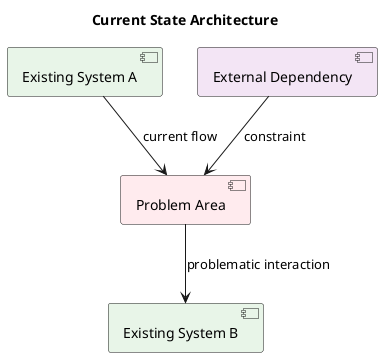
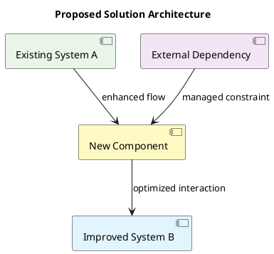
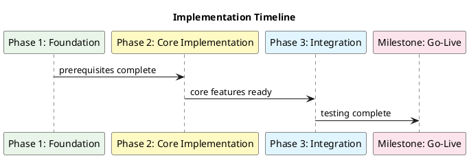

# RFC Summary Workflow

You have access to the atlassian mcp server. Given an RFC document title <RFC-title> or page ID <Page-ID> and space key <Space-key>

## IMPORTANT: Follow these steps EXACTLY in order for consistent results

### 1. Gather RFC Document Information
1. Use the atlassian MCP server to get the RFC document:
   - If given page ID: Use `confluence_get_page` tool with page_id
   - If given title and space: Use `confluence_get_page` tool with title and space_key
   - Set include_metadata to true
   - Set convert_to_markdown to true for consistent formatting
   - Extract and record the following SPECIFIC information:
     - Page title
     - Space key and name
     - Author(s)
     - Creation date
     - Last modified date
     - Version number
     - Page labels (if any)
     - Page URL/ID

2. Get additional context:
   - Use `confluence_get_comments` to retrieve all comments
   - Use `confluence_get_labels` to get all labels
   - Use `confluence_get_page_children` to identify related documents

### 2. Document Structure Analysis
1. Parse the RFC content and identify these EXACT sections (in order):
   - **Title/Header**: Main RFC title and identifier
   - **Abstract/Summary**: Executive summary section
   - **Problem Statement**: What problem is being solved
   - **Proposed Solution**: The main proposal
   - **Technical Details**: Implementation specifics
   - **Alternatives Considered**: Other options evaluated
   - **Impact Assessment**: Effects on systems/processes
   - **Implementation Plan**: How to execute the proposal
   - **Risks and Mitigation**: Potential issues and solutions
   - **Decision/Status**: Current state (Draft/Under Review/Approved/Rejected)

### 3. Content Categorization
Classify the RFC into these EXACT categories:

#### 3.1 RFC Type
- **Architecture**: System design and structure changes
- **Process**: Workflow or procedural changes
- **Technical Standard**: Coding standards, conventions, tools
- **Infrastructure**: Platform, deployment, or operational changes
- **Security**: Security-related proposals
- **Data**: Data management, storage, or processing changes

#### 3.2 Scope Level
- **System-wide**: Affects multiple systems/teams
- **Team-specific**: Limited to specific team/component
- **Cross-functional**: Involves multiple disciplines
- **Experimental**: Proof of concept or trial

#### 3.3 Priority Level
- **Critical**: Must be implemented immediately
- **High**: Important for near-term goals
- **Medium**: Beneficial but not urgent
- **Low**: Nice to have, long-term consideration

### 4. Stakeholder Analysis
1. Identify stakeholders mentioned in the document:
   - **Authors**: Who wrote the RFC
   - **Reviewers**: Who provided feedback/comments
   - **Approvers**: Who has decision authority
   - **Implementers**: Who will execute the proposal
   - **Affected Teams**: Who will be impacted by changes

2. Extract decision timeline:
   - **Proposal Date**: When RFC was created
   - **Review Period**: Comment/feedback timeframe
   - **Decision Date**: When decision was/will be made
   - **Implementation Target**: Planned execution timeline

### 5. Technical Analysis (Use this EXACT format)

#### 5.1 Technologies Involved
- **Primary Technologies**: [List main tech stack components]
- **Dependencies**: [External systems, libraries, services]
- **Integration Points**: [How it connects to existing systems]
- **Data Flow**: [Information movement and transformation]

#### 5.2 Architecture Impact
- **New Components**: [What will be added]
- **Modified Components**: [What will be changed]
- **Deprecated Components**: [What will be removed/replaced]
- **Interface Changes**: [API, protocol, or contract modifications]

### 6. Generate Diagrams (MANDATORY - Use PlantUML format with inline colors)

#### 6.1 Current State Architecture


#### 6.2 Proposed Solution Architecture


#### 6.3 Implementation Flow


### 7. Risk and Impact Assessment (Use this EXACT template)

#### 7.1 Technical Risks
- **High Risk**: [Critical technical challenges or dependencies]
- **Medium Risk**: [Moderate technical concerns]
- **Low Risk**: [Minor technical considerations]

#### 7.2 Business Impact
- **Positive Impact**: [Benefits and improvements]
- **Negative Impact**: [Potential disruptions or costs]
- **Neutral Impact**: [Changes with minimal business effect]

#### 7.3 Implementation Complexity
- **High Complexity**: [Difficult aspects requiring significant effort]
- **Medium Complexity**: [Moderate implementation challenges]
- **Low Complexity**: [Straightforward implementation items]

### 8. Decision Analysis

#### 8.1 Arguments For
1. [List each supporting argument with evidence]
2. [Include quantitative benefits where available]
3. [Reference stakeholder support]

#### 8.2 Arguments Against
1. [List each opposing argument with rationale]
2. [Include cost/risk concerns]
3. [Reference stakeholder concerns]

#### 8.3 Alternative Solutions
1. **Alternative 1**: [Description and why it was rejected]
2. **Alternative 2**: [Description and comparison to chosen solution]
3. **Do Nothing**: [Consequences of maintaining status quo]

### 9. Summary and Recommendations (Use this EXACT format)

#### 9.1 Executive Summary
- **RFC Purpose**: [One sentence describing the main objective]
- **Key Proposal**: [High-level description of the solution]
- **Decision Status**: [Current state: Draft/Under Review/Approved/Rejected/Implemented]
- **Next Steps**: [Immediate actions required]

#### 9.2 Key Metrics and Success Criteria
- **Success Metrics**: [How success will be measured]
- **Timeline**: [Key milestones and deadlines]
- **Resource Requirements**: [People, time, budget needed]
- **Dependencies**: [Critical prerequisites or blockers]

#### 9.3 Recommendation
- **Recommendation**: [Clear recommendation: Approve/Reject/Modify]
- **Rationale**: [Brief justification for recommendation]
- **Conditions**: [Any conditions or requirements for approval]

### 10. Persist Analysis (EXACT naming convention)
1. Create analysis file with this EXACT naming pattern:
   ```
   RFC-<RFC-title-sanitized>-Analysis.md
   ```
   - Replace spaces with hyphens
   - Remove special characters
   - Keep under 50 characters total
2. Save to current working directory (Desktop)
3. Include ALL sections above in the analysis file
4. Add metadata section at the top with:
   - Analysis date (ISO format)
   - RFC source (Confluence page URL)
   - Analyst name
   - Document version analyzed

## CONSISTENCY RULES:
- Always analyze sections in the order listed above
- Use the same diagram color scheme for all RFCs
- Follow the exact section numbering and headers
- Include timestamps in ISO format (YYYY-MM-DDTHH:mm:ssZ)
- Use consistent terminology throughout
- Always include page metadata and comment analysis
- Process stakeholders in alphabetical order
- Categorize risks consistently using the three-tier system
- Include quantitative data where available (dates, numbers, percentages)
- Reference specific page sections and line numbers when quoting content
