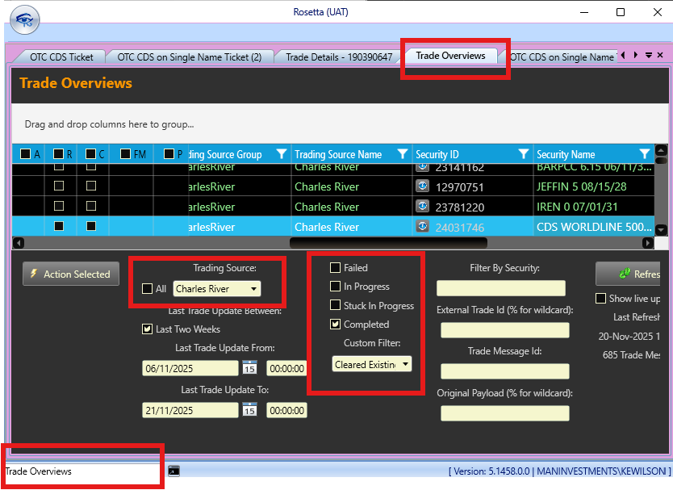
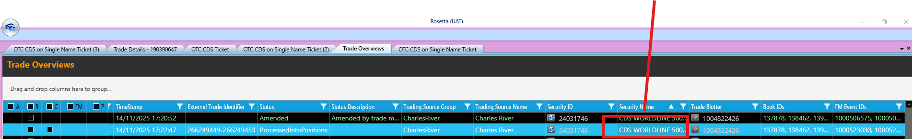
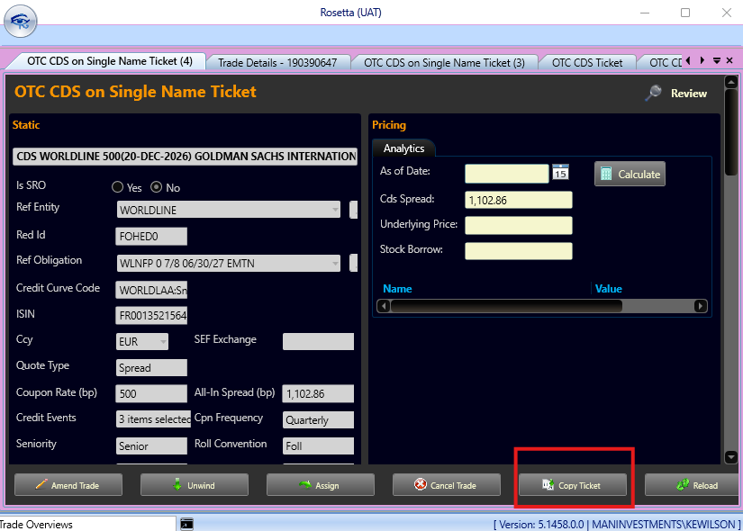
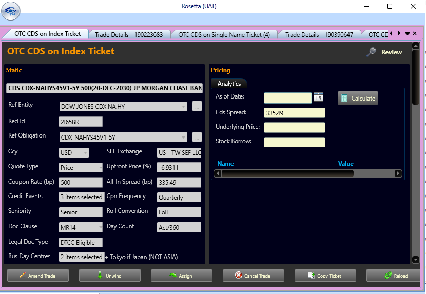

# Rosetta for CDS

[← Back to OMS CDS Notes](./README.md)

If we want to look at CDS trades in Rosetta we need to first open the trade overviews screen and filter it as follows. Make sure the ** Trading Source** is *Charles River* for CDS trades. 

If you sort the trades by Security name this will bring all the CDS together. A single name will look like **CDS WORLDLINE** and an CDS Index will look like **CDS CDX-...**

if you want to see more double click on any row 

This opens the Rosetta **Trade Details** screen and on that we can double click the **Rosa Event Id** information icon to open 

We should then open into **OTC CDS On Single Name Ticket screen** for a single name CDS
. It also has a copy if we want to copy the trade. 

We can do a similar process from the trade overview info for CDS Index. 

