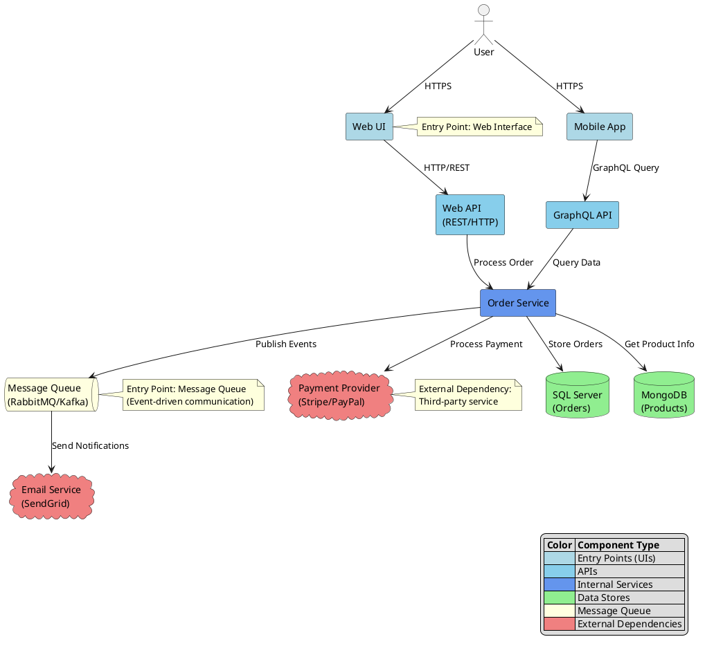
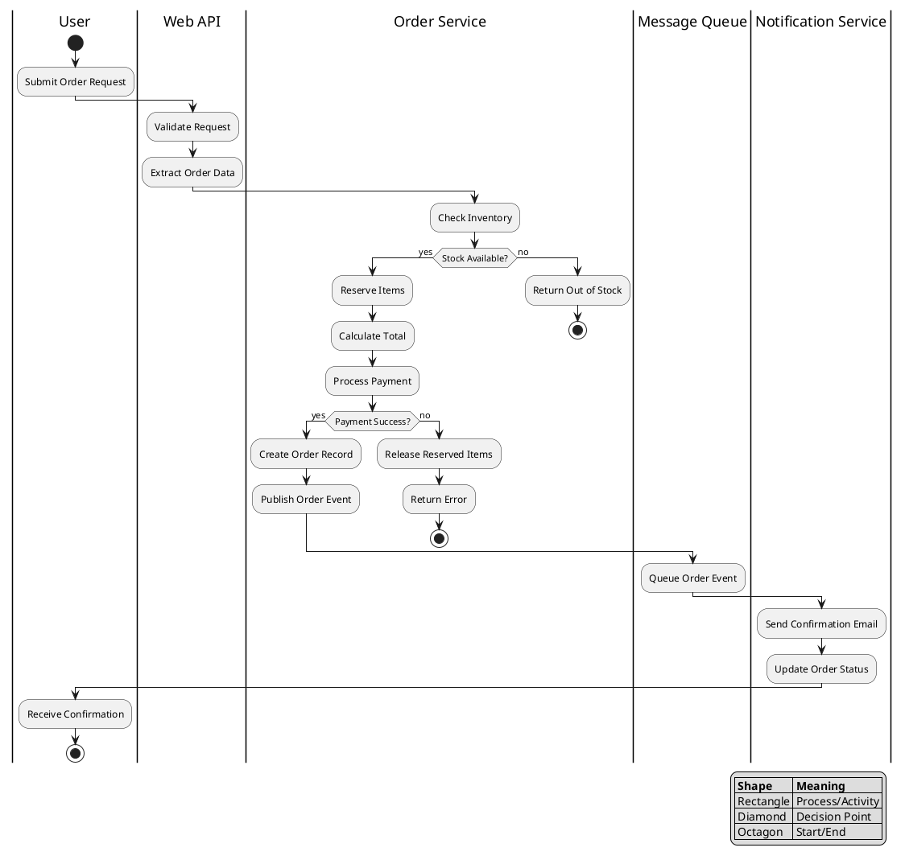
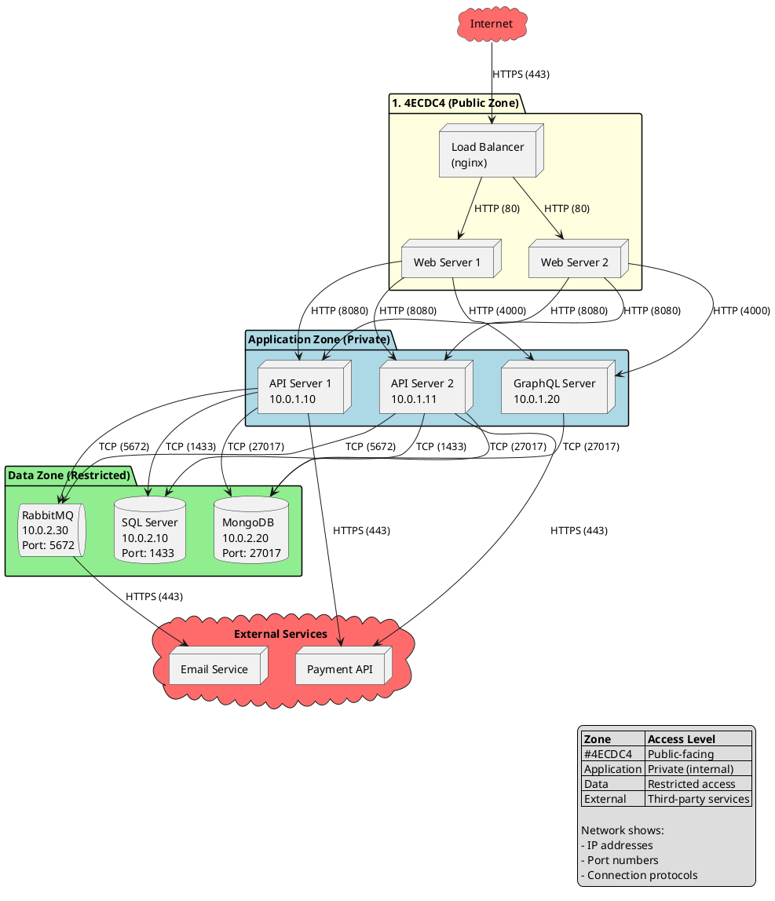

# Quick Learning Techniques for Multi-Service Computer Systems

Here's a systematic approach to quickly understand a new multi-service computer system:

## 1. Start with Architecture Discovery

### System Topology Mapping
- Create a **service dependency diagram** showing data flow between services
- Identify **entry points** (APIs, UIs, message queues) and **data stores**
- Map **external dependencies** (third-party services, databases)
- Use tools like `docker-compose.yml`, Kubernetes manifests, or service mesh configs as starting points

#### Example: Service Dependency Diagram (PlantUML)

#### Resources for Further Reading

**Service Dependency Mapping:**
- [The C4 Model for Software Architecture](https://c4model.com/) - Context, Container, Component, Code diagrams
- [Martin Fowler's Microservices Guide](https://martinfowler.com/microservices/) - Patterns and best practices
- [AWS Architecture Icons](https://aws.amazon.com/architecture/icons/) - For creating architecture diagrams

**PlantUML:**
- [PlantUML Official Documentation](https://plantuml.com/) - Complete syntax reference
- [PlantUML Deployment Diagrams](https://plantuml.com/deployment-diagram) - Specific to system topology
- [Real World PlantUML](https://real-world-plantuml.com/) - Examples from real projects

**System Topology Analysis:**
- [Site Reliability Engineering Book (Chapter 2)](https://sre.google/sre-book/production-environment/) - Google's approach to understanding system topology
- [Kubernetes Cluster Architecture](https://kubernetes.io/docs/concepts/architecture/) - Understanding containerized system topology
- [Microservices Patterns](https://microservices.io/patterns/index.html) - Common architectural patterns and their implications

### Quick Visual Techniques:
- **C4 diagrams** (Context → Container → Component → Code) for different abstraction levels
- **Data flow diagrams** showing how information moves through the system
- **Network topology maps** showing physical/logical connections

#### Example: Data Flow Diagram (PlantUML)

This diagram shows **how data moves through the system** during an order processing workflow, including decision points and error handling.

#### Example: Network Topology Map (PlantUML)

This diagram shows **physical/logical network layout** including zones, IP addresses, ports, and security boundaries.

## 2. Prioritized Investigation Strategy

### Follow the "Critical Path" Method:
1. **User-facing services first** - understand what users actually see/do
2. **Core business logic services** - the "money-making" components
3. **Data persistence layer** - databases, caches, message queues
4. **Supporting services** - logging, monitoring, authentication

### Key Questions to Answer Quickly:
- What does this service *do* for the business?
- What data does it consume/produce?
- How does it fail and recover?
- What are its performance characteristics?

## 3. Documentation and Code Analysis

### Efficient Documentation Review:
- **README files** and API documentation first
- **Configuration files** reveal service relationships
- **Docker/deployment files** show runtime dependencies
- **Test files** often reveal intended behavior better than docs

### Code Reconnaissance:
- Look for **main entry points** (main.py, app.js, etc.)
- Identify **configuration management** patterns
- Find **health check endpoints** and **metrics endpoints**
- Scan for **error handling** and **logging patterns**

## 4. Runtime Investigation

### Observability-First Approach:
- Check **monitoring dashboards** (Grafana, DataDog, etc.)
- Review **log aggregation** systems (ELK stack, Splunk)
- Examine **tracing systems** (Jaeger, Zipkin) for request flows
- Look at **service mesh** configurations (Istio, Linkerd)

### Live System Analysis:
- Use `kubectl get all` or `docker ps` to see running services
- Check **resource utilization** patterns
- Monitor **API call patterns** and response times
- Identify **peak usage** periods and bottlenecks

## 5. Quick Learning Techniques

### Time-Boxed Exploration:
- Spend **2 hours max** on high-level architecture
- **30 minutes per service** for initial understanding
- **1 hour** on data flow and integration points
- **Save deep-dives** for when you need to modify something

### Active Learning Methods:
- **Trace a single request** end-to-end through the system
- **Break something safely** in a dev environment to understand dependencies
- **Modify a small feature** to understand the development workflow
- **Ask targeted questions** to team members about specific components

## 6. Documentation and Knowledge Capture

### Create Your Own Reference:
- **One-page system overview** with key services and their purposes
- **Runbook** for common operations (deploy, debug, scale)
- **Contact sheet** - who owns what service
- **Glossary** of domain-specific terms and acronyms

### Visual Tools to Use:
- **Miro/Lucidchart** for collaborative diagramming
- **PlantUML** for version-controlled diagrams
- **Graphviz** for automatic dependency graphs
- **Service mesh dashboards** for real-time topology

## 7. Red Flags to Watch For

### System Complexity Indicators:
- Services with **no clear single responsibility**
- **Circular dependencies** between services
- **Shared databases** across multiple services
- **Missing or outdated documentation**
- **No standardized logging/monitoring**

## 8. Practical First Week Plan

- **Day 1-2:** Architecture and data flow mapping
- **Day 3-4:** Deep dive into 2-3 core services
- **Day 5:** End-to-end request tracing and integration testing
- **Week 2+:** Hands-on development and iterative learning

---

The key is to **resist the urge to understand everything immediately**. Focus on building a mental model of the system's purpose and major components first, then drill down into specifics as your work requires it.