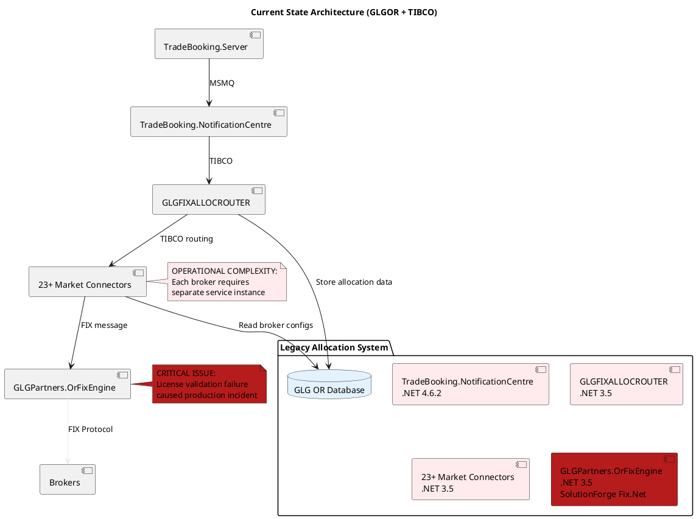
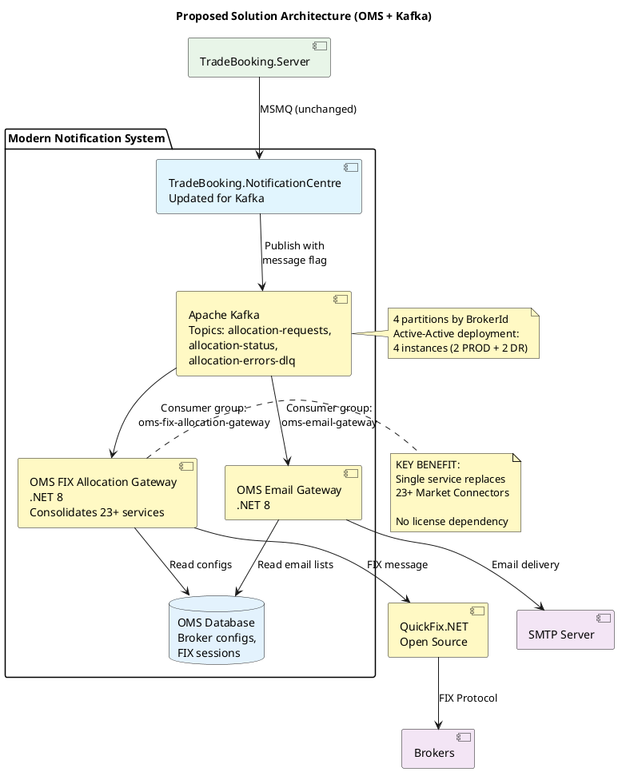
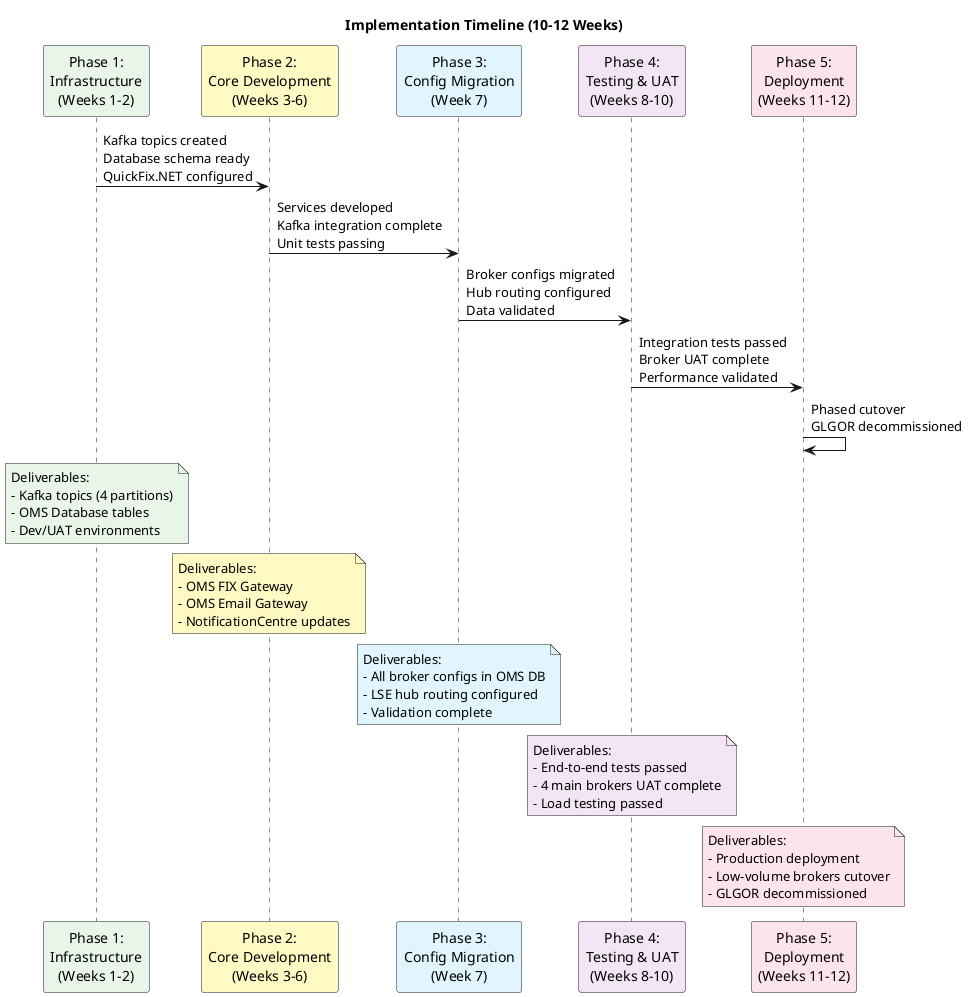

# RFC-087: Migrate TradeBooking.NotificationCentre from GLGOR to OMS - Analysis

## Metadata

- **Analysis Date**: 2025-10-22T00:00:00Z
- **RFC Source**: https://manwiki.maninvestments.com/pages/viewpage.action?pageId=418118067
- **Analyst**: Claude Code
- **Document Version Analyzed**: Version 92
- **RFC Page ID**: 418118067
- **Space**: T (OMT)
- **RFC Status**: Draft (Feedback Requested)

---

## 1. Document Structure Analysis

### 1.1 Title/Header
**RFC-087: Migrate TradeBooking.NotificationCentre from GLGOR to OMS**

### 1.2 Abstract/Summary
Following a critical production incident where TradeBooking.NotificationCentre was unable to send FIX Allocation messages to broker counterparties due to a SolutionForge Fix.Net license validation failure, this RFC proposes migrating the entire FIX allocation workflow from legacy TIBCO-based architecture to modern Kafka + QuickFix.NET solution.

**Key Proposal**: Consolidate 23+ services into 3 services while eliminating the critical dependency that caused production incidents and aligning with modern OMS technology.

### 1.3 Problem Statement
- **Critical Production Incident**: SolutionForge Fix.NET license validation failure prevented sending FIX Allocation messages to broker counterparties
- **Legacy Technology Stack**: Visual Basic components and .NET Framework 3.5 (from 2007) running on outdated infrastructure
- **Operational Complexity**: 23+ broker-specific Market Connector services requiring individual management
- **Dependency on Deprecated Tools**: SVN and Cruise Control for version control and CI/CD
- **TIBCO Infrastructure**: Legacy message bus requiring specialized knowledge and maintenance
- **License Costs**: £45,000 yearly for SolutionForge Fix.NET license

### 1.4 Proposed Solution
Migrate from GLGOR/TIBCO architecture to OMS/Kafka architecture with the following components:

**New Services:**
1. **OMS FIX Allocation Gateway** (.NET 8): Consolidates all 23+ Market Connector services into single gateway using QuickFix.NET
2. **OMS Email Gateway** (.NET 8): Dedicated service for email notification processing
3. **TradeBooking.NotificationCentre** (Updated): Modified to publish to Kafka instead of TIBCO

**Key Architectural Changes:**
- Replace TIBCO with Apache Kafka for message brokering
- Replace SolutionForge Fix.NET with open-source QuickFix.NET
- Consolidate 23+ broker-specific services into single FIX gateway with broker-specific connector logic
- Implement single-topic Kafka architecture with message flags for routing
- Active-Active deployment across PROD and DR datacenters (4 instances total per service)

### 1.5 Technical Details

#### Technology Stack
- **Message Broker**: Apache Kafka (replacing TIBCO)
- **FIX Engine**: QuickFix.NET (replacing SolutionForge Fix.NET)
- **Runtime**: .NET 8 (upgrading from .NET 3.5 and .NET 4.6.2)
- **Database**: SQL Server (OMS Database for configurations and FIX session state)
- **Observability**: Axon telemetry framework

#### Kafka Architecture
- **Topic Strategy**: Single topic (`allocation-requests`) with 4 partitions
- **Partitioning**: By BrokerId to ensure FIX session affinity
- **Consumer Groups**: Two independent groups (`oms-fix-allocation-gateway`, `oms-email-gateway`)
- **Status Reporting**: Independent status publishing to `allocation-status` topic
- **Error Handling**: Dead letter queue (`allocation-errors-dlq`) for failed messages

#### FIX Protocol Implementation
- **Session Management**: Database-backed IMessageStore implementation (following OMS Execution Gateway pattern)
- **Sequence Numbers**: Automatic persistence via QuickFix.NET
- **Message Classes**: Code-generated strongly-typed classes from FIX 4.4 specification
- **Connection Lifecycle**: Graceful shutdown during Kafka rebalancing with 5-10 second failover

#### Multi-Instance Coordination
- **Deployment**: 4 active instances per service (2 PROD + 2 DR)
- **Load Balancing**: Kafka consumer group automatic partition assignment
- **Failover**: Automatic rebalancing on instance failure
- **Session Recovery**: FIX sessions recovered from database on partition reassignment

### 1.6 Alternatives Considered
The RFC does not explicitly document alternative solutions, but implies the following were rejected:
1. **Keep GLGOR/TIBCO**: Rejected due to production incident risk and license costs
2. **Upgrade SolutionForge License**: Not mentioned, likely rejected due to cost and vendor lock-in
3. **Multiple Kafka Topics**: Rejected in favor of single-topic architecture for simplicity

### 1.7 Impact Assessment

#### Positive Impacts
- **Cost Savings**: £45,000 annual license savings
- **Service Consolidation**: 23+ services reduced to 3 services
- **Technology Modernization**: .NET 3.5 (2007) → .NET 8 (2024)
- **Improved Observability**: Axon telemetry framework integration
- **Reduced Operational Complexity**: Single gateway instead of 23+ services
- **Eliminated Critical Dependency**: No more SolutionForge license risk

#### Negative Impacts
- **Implementation Effort**: 10-12 weeks development and testing
- **Broker Coordination**: Requires UAT testing with all broker counterparties
- **Operational Learning Curve**: New architecture for support teams
- **Configuration Migration**: All broker configs must be migrated from GLGOR to OMS Database

#### Systems Affected
- **TradeBooking.Server**: MSMQ integration preserved (no changes)
- **TradeBooking.NotificationCentre**: Kafka producer implementation
- **TradeEnrichment.Service**: MessageRouter integration preserved (no changes)
- **GLGOR Services**: All 23+ services to be decommissioned
- **OMS Database**: New tables for broker configs and FIX session state

### 1.8 Implementation Plan

**Timeline**: 10-12 weeks

**Phase 1: Infrastructure and Foundation (Weeks 1-2)**
- Kafka topic setup and configuration
- Database schema creation
- Development environment setup
- QuickFix.NET code generation setup

**Phase 2: Core Service Development (Weeks 3-6)**
- OMS FIX Allocation Gateway development
- OMS Email Gateway development
- TradeBooking.NotificationCentre Kafka integration

**Phase 3: Broker Configuration Migration (Week 7)**
- Extract configurations from GLGOR database
- Migrate to OMS Database
- Validate all broker configurations
- Configure hub broker routing (LSE, etc.)

**Phase 4: Testing and Validation (Weeks 8-10)**
- Unit testing
- Integration testing (Kafka rebalancing, FIX session recovery)
- UAT with broker connectivity
- Performance testing

**Phase 5: Deployment and Cutover (Weeks 11-12)**
- Production deployment
- Phased cutover (low-volume brokers first)
- Parallel GLGOR running as safety net
- GLGOR decommissioning after validation

### 1.9 Risks and Mitigation

#### Technical Risks
- **Broker Coordination Delays**: Start UAT coordination early in Phase 2
- **Hub Broker Complexity**: Allocate additional time buffer for LSE hub routing
- **Kafka Rebalancing Impact**: FIX sessions may experience 5-30 second downtime during rebalancing
- **Dual Connection Issues**: Brokers may reject multiple simultaneous connections

#### Mitigation Strategies
- **Parallel Running**: GLGOR remains operational during phased cutover
- **Phased Rollout**: Start with low-volume brokers before migrating high-volume brokers
- **Graceful FIX Shutdown**: OnPartitionsRevoked callback ensures clean session termination
- **Circuit Breaker**: Isolate failing brokers without affecting others

### 1.10 Decision/Status
**Current Status**: Draft (Feedback Requested)

**Comments Received**: 25 comments from Kenny Wilson and Yarden Jacobson requesting:
- Simplified architecture diagrams
- Clarification on current vs. target workflows
- Details on connector management and FIX message mapping
- Configuration management approach
- Transactional guarantees and error handling
- HA/DR topology clarification

**Key Open Questions** (from Section 6.2 and 7.0):
1. OMS Database replication strategy between PROD and DR
2. Kafka broker distribution across datacenters
3. Broker concurrent connection policies
4. Hub broker routing implementation details
5. Configuration management solution (Database vs. Consul vs. Execution Team ownership)

---

## 2. Content Categorization

### 2.1 RFC Type
**Architecture** - This RFC proposes significant system design and structure changes, migrating from legacy TIBCO-based architecture to modern Kafka-based architecture with complete service consolidation.

### 2.2 Scope Level
**System-wide** - Affects multiple systems and teams:
- Trade Booking system
- OMS platform
- GLGOR legacy infrastructure
- All broker integrations (23+ counterparties)
- Support teams (operational procedures)

### 2.3 Priority Level
**Critical** - Must be implemented to address:
- Production incident risk (SolutionForge license failure)
- Unsupported technology stack (.NET 3.5 from 2007)
- High operational costs (£45,000 annual license + maintenance overhead)

---

## 3. Stakeholder Analysis

### 3.1 Identified Stakeholders

#### Authors
- **Andrei-Catalin Cristea (London)** - RFC Champion, responded to comments

#### Reviewers
- **Kenny Wilson (London)** - Provided architectural feedback, requested simplified diagrams
- **Yarden Jacobson (London)** - Extensive technical review (19 comments), questioned design decisions
- **Assad Zahieer (Manchester)** - Suggested outbox pattern implementation

#### Approvers
- **Man OMS** (stakeholder group) - Decision authority not explicitly named

#### Implementers
- **AHL OMS Team** - Primary implementation team (inferred from space and context)
- **OMS Support** - Operational support post-deployment

#### Affected Teams
- **Trade Booking Team** - Upstream system sending allocation requests
- **GLGOR Support Team** - Legacy system decommissioning
- **Execution Team** - Potential configuration ownership (Option 2 in Section 5.3)
- **Broker Counterparties** - 23+ external brokers requiring UAT coordination

### 3.2 Decision Timeline

- **Proposal Date**: Not explicitly stated (document created date unavailable in metadata)
- **Last Modified**: Version 92 (specific date unavailable)
- **Review Period**: Currently in "Feedback Requested" state
- **Decision Date**: Not yet determined
- **Implementation Target**: 10-12 weeks post-approval

---

## 4. Technical Analysis

### 4.1 Technologies Involved

#### Primary Technologies
- **Apache Kafka**: Message broker for allocation requests and status updates
- **QuickFix.NET**: Open-source FIX protocol engine (replacing SolutionForge Fix.NET)
- **.NET 8**: Modern runtime for all new services
- **SQL Server**: OMS Database for broker configurations and FIX session state
- **SMTP**: Email delivery for allocation notifications
- **Axon**: Telemetry and observability framework

#### Dependencies
- **Existing Kafka Infrastructure**: Shared cluster with 3 brokers
- **OMS Database**: Must be available for new schema
- **MSMQ**: Preserved for TradeBooking.Server → NotificationCentre communication
- **MessageRouter**: Preserved for TradeEnrichment.Service integration
- **Broker UAT Environments**: Required for testing FIX connectivity

#### Integration Points
- **Upstream**: TradeBooking.Server sends allocation requests via MSMQ (unchanged)
- **Downstream**:
  - 23+ broker counterparties via FIX protocol
  - SMTP server for email notifications
  - TradeEnrichment.Service via MessageRouter (for RFMD/EquitySwap notifications)
- **Internal**: Kafka topics for inter-service communication

#### Data Flow
1. **Allocation Request**: TradeBooking.Server → NotificationCentre (MSMQ)
2. **Delivery Method Determination**: NotificationCentre determines FIX+Email or Email-only
3. **Kafka Publishing**: NotificationCentre → Kafka (`allocation-requests` topic with message flag)
4. **Parallel Processing**:
   - FIX Gateway consumes, filters by flag, sends FIX messages to brokers
   - Email Gateway consumes, filters by flag, sends emails via SMTP
5. **Independent Status**: Each gateway publishes status to `allocation-status` topic
6. **Error Routing**: Failed messages routed to `allocation-errors-dlq` topic

### 4.2 Architecture Impact

#### New Components
1. **OMS FIX Allocation Gateway** (.NET 8)
   - Kafka consumer with manual commit
   - QuickFix.NET integration with database-backed message store
   - Broker-specific connector logic (consolidated from 23+ services)
   - Circuit breaker and error handling
   - 4 active instances (2 PROD + 2 DR)

2. **OMS Email Gateway** (.NET 8)
   - Kafka consumer with email flag filtering
   - SMTP integration with retry policies
   - Dead letter queue routing
   - 4 active instances (2 PROD + 2 DR)

3. **Kafka Topics**
   - `allocation-requests` (4 partitions, replication factor 3)
   - `allocation-status` (status updates from gateways)
   - `allocation-errors-dlq` (failed message handling)

4. **OMS Database Tables**
   - Broker FIX connection configurations
   - FIX message store (IMessageStore implementation)
   - Email distribution lists

#### Modified Components
1. **TradeBooking.NotificationCentre**
   - Add Kafka producer with idempotent configuration
   - Implement message flag logic (FIX+Email or Email-only)
   - Add Kafka status consumer (replaces TIBCO reply listener)
   - Preserve MSMQ consumer (no changes to TradeBooking.Server interface)
   - Preserve MessageRouter integration for TradeEnrichment

#### Deprecated Components
1. **GLGOR Services** (23+ services to be decommissioned)
   - TradeBooking.NotificationCentre (TIBCO version)
   - GLGFIXALLOCROUTER (.NET 3.5)
   - 23+ Market Connector services (.NET 3.5)
   - GLGPartners.OrFixEngine (SolutionForge Fix.NET wrapper)
   - GLG OR Database (broker configs migrated to OMS Database)

2. **Infrastructure**
   - TIBCO message bus (allocation workflow only)
   - SolutionForge Fix.NET license
   - SVN repositories (migrate to Git)
   - Cruise Control CI/CD (migrate to modern CI/CD)

#### Interface Changes
- **TradeBooking.Server → NotificationCentre**: No changes (MSMQ preserved)
- **NotificationCentre → Brokers**: Protocol unchanged (FIX 4.4), but implementation changes
- **NotificationCentre → TradeEnrichment**: No changes (MessageRouter preserved)
- **Internal Communication**: TIBCO → Kafka (breaking change within notification system)

---

## 5. Detailed Architecture Diagrams

### 5.1 Current State Architecture

### 5.2 Proposed Solution Architecture

### 5.3 Implementation Flow

### 5.4 Deployment Topology (Active-Active HA/DR)

```plantuml
@startuml
!define PROD_COLOR #E8F5E8
!define DR_COLOR #E1F5FE
!define KAFKA_COLOR #FFF9C4

title High Availability and Disaster Recovery Topology

package "PROD Datacenter" {
  [OMS FIX Gateway\nInstance 1] PROD_COLOR
  [OMS FIX Gateway\nInstance 2] PROD_COLOR
  [OMS Email Gateway\nInstance 1] PROD_COLOR
  [OMS Email Gateway\nInstance 2] PROD_COLOR
  [NotificationCentre\nInstance 1] PROD_COLOR
}

package "DR Datacenter" {
  [OMS FIX Gateway\nInstance 3] DR_COLOR
  [OMS FIX Gateway\nInstance 4] DR_COLOR
  [OMS Email Gateway\nInstance 3] DR_COLOR
  [OMS Email Gateway\nInstance 4] DR_COLOR
  [NotificationCentre\nInstance 2] DR_COLOR
}

package "Shared Infrastructure" {
  [Kafka Cluster\n3 Brokers\nTopic: allocation-requests\n4 partitions, RF=3] KAFKA_COLOR
  database "OMS Database\nPROD + DR Replication"
}

[OMS FIX Gateway\nInstance 1] --> [Kafka Cluster\n3 Brokers\nTopic: allocation-requests\n4 partitions, RF=3] : Partition 0
[OMS FIX Gateway\nInstance 2] --> [Kafka Cluster\n3 Brokers\nTopic: allocation-requests\n4 partitions, RF=3] : Partition 1
[OMS FIX Gateway\nInstance 3] --> [Kafka Cluster\n3 Brokers\nTopic: allocation-requests\n4 partitions, RF=3] : Partition 2
[OMS FIX Gateway\nInstance 4] --> [Kafka Cluster\n3 Brokers\nTopic: allocation-requests\n4 partitions, RF=3] : Partition 3

[OMS Email Gateway\nInstance 1] --> [Kafka Cluster\n3 Brokers\nTopic: allocation-requests\n4 partitions, RF=3]
[OMS Email Gateway\nInstance 2] --> [Kafka Cluster\n3 Brokers\nTopic: allocation-requests\n4 partitions, RF=3]
[OMS Email Gateway\nInstance 3] --> [Kafka Cluster\n3 Brokers\nTopic: allocation-requests\n4 partitions, RF=3]
[OMS Email Gateway\nInstance 4] --> [Kafka Cluster\n3 Brokers\nTopic: allocation-requests\n4 partitions, RF=3]

[OMS FIX Gateway\nInstance 1] --> [OMS Database\nPROD + DR Replication]
[OMS FIX Gateway\nInstance 2] --> [OMS Database\nPROD + DR Replication]
[OMS FIX Gateway\nInstance 3] --> [OMS Database\nPROD + DR Replication]
[OMS FIX Gateway\nInstance 4] --> [OMS Database\nPROD + DR Replication]

note right of [Kafka Cluster\n3 Brokers\nTopic: allocation-requests\n4 partitions, RF=3] KAFKA_COLOR
  ACTIVE-ACTIVE:
  All 4 instances actively process
  Kafka auto-rebalances on failure

  Failover: 5-10 seconds (clean)
  Failover: up to 30 seconds (unclean)
end note

note bottom of [OMS Database\nPROD + DR Replication]
  OUTSTANDING QUESTION:
  Replication strategy between
  PROD and DR needs clarification
end note

@enduml
```

---

## 6. Risk and Impact Assessment

### 6.1 Technical Risks

#### High Risk
1. **Broker Concurrent Connection Policy** (Severity: Critical)
   - **Risk**: Brokers may reject multiple simultaneous connections from same SenderCompID during Kafka rebalancing
   - **Impact**: FIX allocation failures during partition reassignment
   - **Mitigation**: Graceful FIX session shutdown in OnPartitionsRevoked callback; validation during UAT
   - **Status**: Outstanding question in Section 7.2

2. **Hub Broker Routing Complexity** (Severity: High)
   - **Risk**: LSE hub-and-spoke routing may require custom implementation beyond standard connector logic
   - **Impact**: Extended implementation timeline, potential routing errors
   - **Mitigation**: Allocate additional time buffer in Phase 2; replicate existing GLGOR routing logic
   - **Status**: Outstanding question in Section 7.1

3. **Database Replication Lag** (Severity: High)
   - **Risk**: FIX session state may be stale during cross-datacenter failover (PROD→DR)
   - **Impact**: Sequence number mismatches, broker rejections
   - **Mitigation**: Clarify replication strategy; consider synchronous replication for session state
   - **Status**: Outstanding question in Section 6.2

#### Medium Risk
1. **Kafka Rebalancing Frequency** (Severity: Medium)
   - **Risk**: Frequent rebalancing may cause repeated FIX disconnections (5-30 second downtime each)
   - **Impact**: Broker complaints about connection instability
   - **Mitigation**: Tune Kafka consumer heartbeat and session timeout; monitor rebalancing metrics
   - **Likelihood**: Low (stable deployments have infrequent rebalancing)

2. **Configuration Management Complexity** (Severity: Medium)
   - **Risk**: No consensus on configuration storage (Database vs. Consul vs. Execution Team)
   - **Impact**: Delayed implementation, operational friction
   - **Mitigation**: Start with Database storage (Section 5.3 Option 1); migrate to Consul if needed
   - **Status**: Open question requiring decision

3. **Broker UAT Coordination** (Severity: Medium)
   - **Risk**: Scheduling UAT with 23+ broker counterparties may cause delays
   - **Impact**: Extended Phase 4 timeline (Weeks 8-10)
   - **Mitigation**: Start coordination early in Phase 2; prioritize 4 main brokers (Morgan Stanley, Goldman, Citi, JPM)
   - **Timeline**: Build 2-week buffer into schedule

#### Low Risk
1. **Email Gateway Simplicity** (Severity: Low)
   - **Risk**: Yarden Jacobson questioned value of separate email service (comment ID 421792206)
   - **Impact**: Potential over-engineering
   - **Mitigation**: Evaluate consolidation with FIX Gateway if operational overhead is high
   - **Recommendation**: Proceed with separate service for separation of concerns

2. **QuickFix.NET Learning Curve** (Severity: Low)
   - **Risk**: Team unfamiliar with QuickFix.NET vs. SolutionForge Fix.NET
   - **Impact**: Slower development in Phase 2
   - **Mitigation**: Follow OMS Execution Gateway pattern (proven implementation); leverage QuickFix.NET documentation
   - **Likelihood**: Low (well-documented library with code generation)

### 6.2 Business Impact

#### Positive Impact
1. **Cost Savings**: £45,000 annual license elimination + reduced operational overhead (23+ services → 3 services)
2. **Risk Reduction**: Eliminates critical production incident risk (SolutionForge license failure)
3. **Technology Modernization**: .NET 3.5 (2007) → .NET 8 (2024) enables future enhancements
4. **Improved Observability**: Axon telemetry provides better monitoring and troubleshooting
5. **Operational Simplification**: Single FIX Gateway vs. 23+ Market Connectors reduces support complexity
6. **Alignment with OMS Strategy**: Kafka-based architecture consistent with broader OMS platform

#### Negative Impact
1. **Implementation Cost**: 10-12 weeks development effort (estimated 2-3 FTE)
2. **Broker Coordination Overhead**: UAT testing with 23+ counterparties requires significant coordination
3. **Operational Transition**: Support teams must learn new architecture and troubleshooting procedures
4. **Temporary Dual Maintenance**: GLGOR and OMS systems run in parallel during phased cutover (Weeks 11-12)

#### Neutral Impact
1. **TradeBooking.Server**: No changes required (MSMQ interface preserved)
2. **TradeEnrichment.Service**: No changes required (MessageRouter integration preserved)
3. **Broker Counterparties**: No changes required (FIX 4.4 protocol unchanged)

### 6.3 Implementation Complexity

#### High Complexity
1. **FIX Session Management with Kafka Rebalancing** (Section 5.1.2)
   - Coordinating graceful FIX shutdown during partition reassignment
   - Database-backed message store implementation (IMessageStore)
   - Sequence number recovery across datacenter failover
   - **Estimated Effort**: 2-3 weeks in Phase 2

2. **Hub Broker Routing** (Section 7.1)
   - LSE hub-and-spoke routing with multiple sub-brokers
   - Dynamic routing configuration
   - Preserving existing GLGOR routing logic
   - **Estimated Effort**: 1-2 weeks in Phase 2 (with buffer)

3. **Active-Active HA/DR Topology** (Section 6.0)
   - 4-instance deployment across PROD and DR datacenters
   - Cross-datacenter Kafka consumer coordination
   - Database replication for FIX session state
   - **Estimated Effort**: 1 week in Phase 5 + ongoing operational validation

#### Medium Complexity
1. **Broker Configuration Migration** (Phase 3)
   - Extract 23+ broker configs from GLGOR database
   - Transform and validate data for OMS Database schema
   - Test all broker connections in UAT
   - **Estimated Effort**: 1 week in Phase 3

2. **Kafka Consumer Implementation** (Phase 2)
   - Manual commit with idempotency checks
   - Message flag filtering
   - Dead letter queue routing
   - Circuit breaker pattern
   - **Estimated Effort**: 1-2 weeks in Phase 2

3. **Integration Testing** (Phase 4)
   - End-to-end workflow validation
   - Kafka rebalancing scenarios
   - FIX session recovery testing
   - Performance and load testing
   - **Estimated Effort**: 3 weeks in Phase 4

#### Low Complexity
1. **Email Gateway Implementation** (Phase 2)
   - SMTP integration with retry policies
   - Kafka consumer with email flag filtering
   - **Estimated Effort**: 1 week in Phase 2

2. **Kafka Topic Setup** (Phase 1)
   - Create topics with 4 partitions
   - Configure replication factor 3
   - **Estimated Effort**: 1-2 days in Phase 1

3. **QuickFix.NET Code Generation** (Phase 1)
   - Generate strongly-typed message classes from FIX 4.4 spec
   - **Estimated Effort**: 1-2 days in Phase 1

---

## 7. Decision Analysis

### 7.1 Arguments For

1. **Eliminates Critical Production Risk** (Strongest Argument)
   - SolutionForge Fix.NET license validation failure caused production incident
   - Open-source QuickFix.NET eliminates vendor lock-in and license dependency
   - Evidence: Production incident mentioned in Section 1 (Executive Summary)

2. **Significant Cost Savings**
   - £45,000 annual license savings
   - Reduced operational overhead (23+ services → 3 services)
   - Quantifiable ROI within first year

3. **Technology Modernization**
   - .NET 3.5 (2007) is unsupported and poses security/maintenance risks
   - .NET 8 (2024) provides performance improvements and modern language features
   - Enables future enhancements and developer productivity

4. **Operational Simplification**
   - Single FIX Gateway vs. 23+ broker-specific services
   - Unified monitoring and troubleshooting via Axon telemetry
   - Reduced deployment complexity

5. **Alignment with OMS Architecture**
   - Kafka-based messaging consistent with broader OMS platform
   - Follows proven OMS Execution Gateway pattern for FIX integration
   - Stakeholder support: Man OMS team endorsement

6. **Improved Reliability**
   - Active-Active HA/DR deployment (4 instances)
   - Automatic failover via Kafka consumer groups
   - Database-backed FIX session state for recovery

### 7.2 Arguments Against

1. **Implementation Complexity and Risk** (Strongest Concern)
   - 10-12 weeks implementation timeline with multiple unknowns
   - Hub broker routing complexity (Section 7.1 outstanding question)
   - Broker concurrent connection policies unclear (Section 7.2)
   - Evidence: 25 comments from reviewers requesting clarification

2. **Broker Coordination Overhead**
   - Requires UAT testing with 23+ broker counterparties
   - Scheduling complexity may delay Phase 4
   - Potential for broker-specific issues discovered late in testing

3. **Operational Learning Curve**
   - Support teams must learn new Kafka-based architecture
   - Different troubleshooting procedures vs. GLGOR/TIBCO
   - Temporary dual maintenance during cutover

4. **Outstanding Architectural Questions** (From reviewer comments)
   - **Yarden Jacobson concerns**:
     - Value of separate email service (comment 421792206)
     - Transactional guarantees with Kafka (comment 421792252)
     - Configuration management approach (comment 421792654)
     - FIX connector management and monitoring (comment 421792417)
   - **Kenny Wilson concerns**:
     - Simplified architecture diagrams needed (comment 421789826)
     - Current vs. target workflow clarity (comment 421792195)

5. **Database Replication Uncertainty**
   - PROD/DR replication strategy unclear (Section 6.2)
   - Potential for stale FIX session state during failover
   - May require synchronous replication (performance impact)

### 7.3 Alternative Solutions

#### Alternative 1: Renew SolutionForge License and Modernize GLGOR
**Description**: Keep GLGOR architecture but upgrade to supported .NET versions and renew SolutionForge license

**Pros**:
- Lower implementation risk (incremental changes)
- No broker UAT coordination required
- Familiar architecture for support teams

**Cons**:
- Continues vendor lock-in (£45,000 annual cost)
- Does not address service consolidation (23+ services remain)
- TIBCO infrastructure remains (specialized knowledge required)
- Does not align with OMS architecture strategy

**Why Rejected**: Does not solve root cause (vendor dependency) and misses opportunity for service consolidation

#### Alternative 2: Multi-Topic Kafka Architecture
**Description**: Use separate Kafka topics for FIX and Email workflows instead of single topic with message flags

**Pros**:
- Cleaner separation of concerns
- No message flag filtering logic needed
- Independent scaling of FIX vs. Email topics

**Cons**:
- Requires Kafka transactions for atomic publishing to two topics
- Increased complexity in NotificationCentre (transaction coordination)
- More topics to manage and monitor

**Why Rejected**: Single-topic architecture is simpler and compatible with future outbox pattern (Section 5.2)

#### Alternative 3: Do Nothing (Maintain Status Quo)
**Description**: Continue operating GLGOR/TIBCO with production incident risk

**Consequences**:
- Ongoing £45,000 annual license cost
- Production incident risk remains (SolutionForge license failure)
- Technical debt accumulates (.NET 3.5 increasingly unsupported)
- Operational complexity persists (23+ services)
- Misalignment with OMS architecture strategy

**Why Rejected**: Unacceptable production risk and missed cost savings opportunity

---

## 8. Summary and Recommendations

### 8.1 Executive Summary

- **RFC Purpose**: Migrate TradeBooking.NotificationCentre from legacy GLGOR/TIBCO architecture to modern OMS/Kafka architecture to eliminate critical production incident risk and reduce operational costs
- **Key Proposal**: Consolidate 23+ services into 3 services using Kafka + QuickFix.NET, eliminating SolutionForge Fix.NET dependency
- **Decision Status**: Draft (Feedback Requested) - 25 comments received requesting architectural clarifications
- **Next Steps**: Address outstanding questions (Sections 6.2 and 7.0), finalize configuration management approach, obtain approval, begin Phase 1 implementation

### 8.2 Key Metrics and Success Criteria

#### Success Metrics
1. **Zero Production Incidents**: No SolutionForge license failures or allocation delivery failures
2. **Service Consolidation**: 23+ Market Connector services reduced to 1 FIX Gateway
3. **Cost Savings**: £45,000 annual license elimination achieved
4. **FIX Session Uptime**: >99.9% availability (excluding planned maintenance)
5. **Failover Time**: <30 seconds for instance failure, <60 seconds for datacenter failure
6. **Message Delivery**: 100% of allocations delivered to brokers (with retry/DLQ for transient failures)

#### Timeline
- **Phase 1 (Infrastructure)**: Weeks 1-2
- **Phase 2 (Development)**: Weeks 3-6
- **Phase 3 (Config Migration)**: Week 7
- **Phase 4 (Testing/UAT)**: Weeks 8-10
- **Phase 5 (Deployment)**: Weeks 11-12
- **Total Duration**: 10-12 weeks

#### Resource Requirements
- **Development Team**: 2-3 FTE for 10-12 weeks
- **Broker UAT Coordination**: 1 FTE for Weeks 8-10 (Phase 4)
- **Infrastructure**: Kafka cluster (existing), OMS Database (existing), 4 VM instances per service
- **Budget**: Development effort + infrastructure costs (license savings offset costs)

#### Dependencies
1. **Kafka Infrastructure**: Existing Kafka cluster with 3 brokers (available)
2. **OMS Database**: Available for new schema (Phase 1)
3. **Broker UAT Environments**: Access required for 23+ counterparties (Phase 4)
4. **QuickFix.NET**: Open-source library (no procurement needed)
5. **Parallel GLGOR Running**: GLGOR must remain operational during cutover (Weeks 11-12)

### 8.3 Recommendation

**Recommendation**: **Approve with Conditions**

**Rationale**:
1. **Critical Business Need**: Production incident risk and £45,000 annual cost justify migration
2. **Technical Soundness**: Architecture follows proven OMS Execution Gateway pattern
3. **Operational Benefits**: Service consolidation (23+ → 3) significantly reduces complexity
4. **Strategic Alignment**: Kafka-based architecture aligns with OMS platform direction

**Conditions for Approval**:

1. **Resolve Outstanding Architectural Questions** (Prior to Phase 1)
   - **Section 6.2 (HA/DR)**: Clarify OMS Database replication strategy and Kafka broker distribution
   - **Section 7.1 (Hub Brokers)**: Document LSE hub routing implementation approach
   - **Section 7.2 (Broker Policies)**: Validate concurrent connection policies with 4 main brokers
   - **Section 5.3 (Configuration)**: Decide on configuration management approach (Database vs. Consul vs. Execution Team)

2. **Address Reviewer Concerns** (Prior to Phase 1)
   - **Yarden Jacobson**: Provide detailed response to transactional guarantees question (comment 421792252)
   - **Yarden Jacobson**: Clarify FIX connector management and monitoring approach (comment 421792417)
   - **Kenny Wilson**: Create simplified current-state architecture diagram (comment 421789826)
   - **Assad Zahieer**: Evaluate outbox pattern integration timeline (comment 421792969)

3. **Risk Mitigation Plan** (Prior to Phase 4)
   - Document broker UAT coordination plan with specific dates and contacts
   - Create rollback procedure for phased cutover (Week 11-12)
   - Define success criteria for each broker cutover (low-volume first)
   - Establish support escalation process for post-deployment issues

4. **Phased Approval Gates** (Throughout Implementation)
   - **Gate 1 (End of Phase 1)**: Infrastructure validated, database schema approved
   - **Gate 2 (End of Phase 2)**: Core services code review, unit tests passing
   - **Gate 3 (End of Phase 4)**: UAT with 4 main brokers successful, performance validated
   - **Gate 4 (Week 11)**: Low-volume broker cutover successful, proceed with full rollout

**Alternative Recommendation if Conditions Cannot Be Met**:
Defer approval and conduct 2-week discovery phase to resolve outstanding questions, then re-submit RFC with clarifications.

---

## 9. Appendix: Comment Analysis

### 9.1 Comment Themes

**Theme 1: Architecture Simplification** (4 comments)
- Kenny Wilson: "need some human hand crafted... simpler sequence and existing system architecture" (421789826)
- Yarden Jacobson: "can it be outlined as steps not just diagram?" (421792189)
- Yarden Jacobson: "is this the target workflow or current workflow?" (421792195)
- Yarden Jacobson: "please mark the new components clearly" (421792197)

**Theme 2: Service Design Questions** (5 comments)
- Yarden Jacobson: "do we need a separate service to send emails?" (421792206)
- Yarden Jacobson: "what's the value of a publisher to send same data twice for FIX+Email?" (421792214)
- Yarden Jacobson: "could also be solved by having single topic with OneOf" (421792230)
- Yarden Jacobson: "unclear value of standalone service" (421792427)
- Assad Zahieer: "We could leverage the outbox publisher here" (421792969)

**Theme 3: Technical Implementation Details** (8 comments)
- Yarden Jacobson: "how is kafka transaction ensure atomicity?" (421792252)
- Yarden Jacobson: "how are we planning to handle individual connectors within single service?" (421792417)
- Yarden Jacobson: "is it going to be like Phoebe or like OMS Execution gateway?" (421792422)
- Yarden Jacobson: "how is it done today?" (421792433)
- Yarden Jacobson: "is it an OMS concern or should be sourced elsewhere?" (421792650)
- Yarden Jacobson: "why not consul or other live config solutions?" (421792654)
- Yarden Jacobson: "are we talking about single consumer group across all instances or one per broker?" (421792663)
- Assad Zahieer: "I agree with one group... defeats the purpose of the RFC" (421793449)

**Theme 4: Operational Concerns** (4 comments)
- Yarden Jacobson: "I assume that will go to OMS Support? what's the resolution process / fallback?" (421792425)
- Yarden Jacobson: "Please add reference to DR / HA topology" (421792414)
- Yarden Jacobson: "have we got any feedback today from GLGOR back to THK?" (421792412)
- Kenny Wilson: "TradeBooking.NotificationCentre is legacy but it is in the Modern Notification System part" (421804533)

**Theme 5: Documentation Updates** (2 comments)
- Yarden Jacobson: "missing some of the key benefits" (421792088)
- Andrei Cristea: "Addressed!" (421792192) + "changed the RFC significantly since Yarden's comments" (421804540)

### 9.2 Unresolved Comments

The following comments appear to require follow-up:

1. **Comment 421792252** (Yarden): Kafka transaction atomicity - Partially addressed in Section 5.2, but could be expanded
2. **Comment 421792417** (Yarden): Individual connector management - Not fully addressed in RFC
3. **Comment 421792422** (Yarden): Phoebe vs. OMS Execution Gateway pattern - Not explicitly answered
4. **Comment 421792650** (Yarden): Configuration ownership (OMS vs. elsewhere) - Open question in Section 5.3
5. **Comment 421792654** (Yarden): Why not Consul for config - Listed as Option 3 in Section 5.3 but no decision
6. **Comment 421804533** (Kenny): NotificationCentre categorization - May need diagram clarification

---

## Document Change History

| Version | Date | Changes |
|---------|------|---------|
| 1.0 | 2025-10-22 | Initial analysis created from RFC Version 92 |

---

**End of Analysis**
