You are helping review a BitBucket pull request **AUTOMATICALLY**.

## PR URL: {{arg1}}

**IMPORTANT**: This is an automated review. You will:
1. Perform a complete PR review following all steps
2. Write the review output to a markdown file
3. Send a desktop notification when complete
4. DO NOT ask for user approval - all tools are pre-approved

---

## Automated Review Process

Follow these steps **without stopping for approval**:

### 1. Checkout the PR Branch
Run: `pkm checkout {{arg1}}`

Note the repository, system, and branch name from the output.

### 2. Extract PR Details from URL and Map to Source Code
Parse the URL to get:
- Project key (e.g., ETS, OMS, GCP)
- Repository name (e.g., tomahawk2, oms-implementation, manos-positions-api)
- PR number

**Map PR URL to Source Code Location**:
- The project key in the URL maps directly to the system name
- The repository name maps to the service name
- Example: `https://mangit.maninvestments.com/projects/GCP/repos/manos-positions-api/pull-requests/123`
  - Project Key: `GCP` → System directory: `/turbo/kewilson/github/pkm/systems/GCP/`
  - Repo: `manos-positions-api` → Service directory: `/turbo/kewilson/github/pkm/systems/GCP/service-repositories/manos-positions-api/`
  - **SOURCE_ROOT** = `/turbo/kewilson/github/pkm/systems/GCP/service-repositories/manos-positions-api/`
- Use this SOURCE_ROOT path for all file operations in this review

### 3. Fetch PR Information via Bitbucket MCP

Use these MCP tools to gather context:

- **mcp__bitbucket__bitbucket_get_pull_request** - Get PR title, description, author, status
- **mcp__bitbucket__bitbucket_get_pull_request_changes** - Get list of files changed with stats
- **mcp__bitbucket__bitbucket_get_pr_diff** - Get detailed line-by-line changes
  - For getting individual file diffs with actual code, use: `mode=file` and `file_path=<path>`
  - This returns the actual diff hunks with before/after code that you can show in the review
- **mcp__bitbucket__bitbucket_get_pr_activities** - Get existing comments and review feedback (optional)

**Critical**: For each file being reviewed, fetch the file-specific diff using:
```
mcp__bitbucket__bitbucket_get_pr_diff(
  mode="file",
  file_path="src/path/to/File.cs",
  context_lines=3
)
```
This gives you the actual code changes to include in the review.

### 4. Locate and Verify Source Code Directory

**Important**: Verify the source code location:

1. Using the mapping from step 2, construct the SOURCE_ROOT path:
   - `SOURCE_ROOT = /turbo/kewilson/github/pkm/systems/{project_key}/service-repositories/{repo_name}/`
2. Verify the directory exists: `ls -la {SOURCE_ROOT}`
3. Use this SOURCE_ROOT for all subsequent file read operations

### 5. Identify Entry Points and Call Paths

**Critical Step**: Before diving into file details, identify how the changed code is invoked.

For each changed file/class/method, trace backwards to find:

**Entry Points** - Where execution starts:
- 🌐 **HTTP Endpoints**: API controllers, REST endpoints, web routes
- 📨 **Message Handlers**: Queue consumers, event handlers, pub/sub subscribers
- ⏰ **Scheduled Jobs**: Cron jobs, background tasks, timers
- 🗄️ **Database Triggers**: Stored procedures that call this code
- 🔌 **External Integrations**: Webhooks, callbacks, external system calls
- 🖥️ **CLI Commands**: Command-line entry points
- 🧪 **Test Entry Points**: How tests invoke this code

**Analysis Steps**:
1. Use `Grep` to search for references to changed classes/methods across the SOURCE_ROOT
2. Identify which entry points have call stacks that reach the changed code
3. Determine the execution paths from entry point → changed code
4. Note any middleware, filters, or interceptors in the call chain

### 6. Analyze Each Changed File

For each changed file, provide a detailed review:

1. **Read the full file** from `{SOURCE_ROOT}/[file-path]` where SOURCE_ROOT was determined in step 4
2. **Understand the context** - How does this file fit in the codebase?
3. **Extract actual code changes from the diff** - Get the specific hunks/segments that changed
4. **Use Grep** to search for references within the SOURCE_ROOT directory only

**Important**: When reviewing changes, use the diff data from `mcp__bitbucket__bitbucket_get_pr_diff` to:
- Get the actual before/after code for each change
- Show the specific lines that were added (+ prefix) and removed (- prefix)
- Include surrounding context lines to show where the change occurred
- Link to specific line numbers in BitBucket using format: `{pr-url}#path/to/file.ext-{line-number}`

### 8. Review Each File

For each file, analyze:

- **🔴 Critical Issues**: Security vulnerabilities, bugs, breaking changes, data loss risks
- **🟡 Code Quality**: Readability, error handling, naming conventions, complexity
- **🔵 Best Practices**: Design patterns, SOLID principles, code duplication, maintainability
- **🟢 Testing**: Test coverage, edge cases, test quality
- **⚡ Performance**: Performance impacts, resource usage, scalability concerns

### 9. Generate Complete Review Report

Structure your review as:

```
## PR Review: [Title]

**Repository**: [system]/[repo]
**Branch**: [branch-name]
**Author**: [author]
**PR Link**: [full BitBucket URL]
**Reviewed**: [current date/time]
**Review Mode**: Automated

### Summary
[1-2 sentence overview of what this PR accomplishes]

---

## 🎯 Entry Points Analysis

### Changed Code Units
- `ClassName.MethodName()` in `File.cs`
- `AnotherClass.AnotherMethod()` in `File2.cs`

### Entry Points Affected

#### 🌐 HTTP: `POST /api/orders/create`
- **Controller**: `OrdersController.CreateOrder()`
- **Call Path**: `CreateOrder()` → `OrderService.ProcessOrder()` → `[CHANGED] OrderValidator.Validate()`
- **Impact**: Order creation workflow
- **Users Affected**: Trading desk, client portal

[Repeat for each entry point...]

### Impact Summary
- **Total Entry Points**: [count]
- **User-Facing**: [count] (list them)
- **System-to-System**: [count] (list them)
- **Background Jobs**: [count] (list them)

### 📊 Diagrams

#### System Architecture - Changed Components


#### Call Stack - Entry Point to Changed Code
For **each major entry point**, generate a sequence diagram showing the flow:

```plantuml
@startuml
!define ENTRY #E3F2FD
!define UNCHANGED #FFFFFF
!define MODIFIED #FFF9C4
!define DATA #FCE4EC

title Call Stack: POST /api/orders/create → Changed Code

participant "Client" ENTRY
participant "OrdersController" UNCHANGED
participant "OrderService" UNCHANGED
participant "OrderValidator\n[MODIFIED]" MODIFIED
participant "Database" DATA

Client -> "OrdersController" : POST /api/orders/create
activate "OrdersController"

"OrdersController" -> "OrderService" : ProcessOrder(orderDto)
activate "OrderService"

"OrderService" -> "OrderValidator\n[MODIFIED]" : Validate(order)
activate "OrderValidator\n[MODIFIED]"
note right
  🔄 CHANGED CODE
  New validation logic
  added here
end note

"OrderValidator\n[MODIFIED]" -> "OrderValidator\n[MODIFIED]" : ValidateQuantity()
"OrderValidator\n[MODIFIED]" -> "OrderValidator\n[MODIFIED]" : ValidatePrice()

"OrderValidator\n[MODIFIED]" --> "OrderService" : ValidationResult
deactivate "OrderValidator\n[MODIFIED]"

"OrderService" -> "Database" : SaveOrder()
activate "Database"
"Database" --> "OrderService" : success
deactivate "Database"

"OrderService" --> "OrdersController" : OrderCreatedDto
deactivate "OrderService"

"OrdersController" --> Client : 201 Created
deactivate "OrdersController"

@enduml
```



---

## File-by-File Review

### 📄 `path/to/File1.cs`
**[View in BitBucket]({pr-url}#path/to/File1.cs)**

#### Changes Made

For each significant change, show the actual code diff with explanatory context:

**Line X-Y: [Brief description of what changed]**
```diff
- old code line 1
- old code line 2
+ new code line 1
+ new code line 2
  unchanged context line
```
[Explain why this change was made and its impact]

**[View this change in BitBucket]({pr-url}#path/to/File1.cs-X)**

[Repeat for each distinct change in the file]

#### Review Comments

**🔴 Critical Issues**
- Line XXX: [Issue description and recommendation]

**🟡 Code Quality**
- Line XXX: [Observation and suggestion]

**🔵 Best Practices**
- [Comment on design patterns, architecture, etc.]

**🟢 Testing**
- [Comment on test coverage for this file]

**⚡ Performance**
- [Any performance considerations]

**✅ Positive**
- [Highlight good practices in this file]

---

### 📄 `path/to/File2.cs`
**[View in BitBucket]({pr-url}#path/to/File2.cs)**

#### Changes Made

**Line 52-59: Changed from `.Result` to `.GetAwaiter().GetResult()` to avoid deadlocks**

```diff
  var httpClient = httpClientFactory.CreateClient("AuthService");
  try
  {
-     var response = httpClient.GetAsync(authEndpointUrl).Result;
+     var response = httpClient.GetAsync(authEndpointUrl).GetAwaiter().GetResult();
      if (response.StatusCode != HttpStatusCode.OK)
      {
          logger.LogError("Auth service returned error status code: {StatusCode}", response.StatusCode);
          return;
      }

-     var authSettingsString = response.Content.ReadAsStringAsync().Result;
+     var authSettingsString = response.Content.ReadAsStringAsync().GetAwaiter().GetResult();
      var authSettings = jsonSerializer.Deserialize<Dictionary<string, string>>(authSettingsString);
```

Using `.Result` on async operations can cause deadlocks in certain contexts. The safer pattern `.GetAwaiter().GetResult()` is used here since this is constructor initialization where async context is not available.

**[View this change in BitBucket]({pr-url}#path/to/File2.cs-52)**

#### Review Comments

[Reviews for this file...]

---

[Repeat structure for each file...]

---

## Overall Assessment

### Summary of Critical Issues
[Consolidated list of blocking issues across all files, or "None found"]

### Summary of Suggestions
[Key non-blocking improvements that would enhance the PR]

### What's Done Well
[Positive aspects across the entire PR]

### Questions for Author
[Clarifications needed]

### Testing Recommendations
Based on entry points, tests should cover:
- [ ] [Specific endpoint test]
- [ ] [Specific handler test]
- [ ] [Edge case based on call path]

### Final Recommendation
**[APPROVE ✅ / REQUEST CHANGES ❌ / COMMENT 💬]**

[1-2 sentence justification]
```

---

### 10. Save Review to File

Create the output directory if it doesn't exist, then write the review:
- Create directory: `pr-reviews` (if not exists)
- Write to: `pr-reviews/pr-{pr-number}-review-{timestamp}.md`
- Use format: `pr-reviews/pr-134-review-20250113-143022.md`

### 11. Convert Review to HTML

After saving the markdown file, convert it to HTML with rendered PlantUML diagrams:

1. Use the conversion script located at `pr-reviews/convert_to_html.py`
2. Run: `python3 pr-reviews/convert_to_html.py pr-reviews/pr-{pr-number}-review-{timestamp}.md`
3. This will create: `pr-reviews/pr-{pr-number}-review-{timestamp}.html`
4. Copy both files to public directory:
   - Create directory: `mkdir -p /data/user/public_html/kewilson/pr-reviews`
   - Copy markdown: `cp pr-reviews/pr-{pr-number}-review-{timestamp}.md /data/user/public_html/kewilson/pr-reviews/`
   - Copy HTML: `cp pr-reviews/pr-{pr-number}-review-{timestamp}.html /data/user/public_html/kewilson/pr-reviews/`

The HTML version will include:
- Rendered PlantUML diagrams as embedded SVG images
- Professional GitHub-like styling
- Clickable links to BitBucket
- Color-coded sections

### 12. Send Slack Notification

After completing the review, send a notification to Slack using the webhook.

**Extract review summary statistics**:
- Count critical issues (🔴)
- Count suggestions (🟡)
- Count files reviewed
- Determine final recommendation (APPROVE/REQUEST CHANGES/COMMENT)

**Prepare Slack payload**:
```bash
curl -X POST \
  -H "Content-Type: application/json" \
  -d '{
    "automation_name": "PR Code Review",
    "pr_url": "{full-pr-url}",
    "pr_title": "{pr-title}",
    "pr_author": "{pr-author}",
    "status": "{status-emoji} Review Complete - {recommendation}",
    "thread_text": "📊 Review Summary:\n• Files reviewed: {file-count}\n• 🔴 Critical issues: {critical-count}\n• 🟡 Suggestions: {suggestion-count}\n• 🟢 Positive highlights: {positive-count}\n• ⚡ Performance concerns: {performance-count}\n\n📝 Full review: pr-reviews/pr-{pr-number}-review-{timestamp}.md\n🌐 HTML version: http://dlonapgcps90/~kewilson/pr-reviews/pr-{pr-number}-review-{timestamp}.html\n\n💡 Recommendation: {recommendation-with-reason}"
  }' \
  https://hooks.slack.com/triggers/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
```

**Status emoji mapping**:
- ✅ if recommendation is APPROVE
- ❌ if recommendation is REQUEST CHANGES
- 💬 if recommendation is COMMENT

**Example payload**:
```json
{
  "automation_name": "PR Code Review",
  "pr_url": "https://mangit.maninvestments.com/projects/ETS/repos/tomahawk2/pull-requests/378",
  "pr_title": "GLG-8491: Update to GLGPartners.Helga.Interfaces 3.20.0",
  "pr_author": "john.smith",
  "status": "✅ Review Complete - APPROVE",
  "thread_text": "📊 Review Summary:\n• Files reviewed: 5\n• 🔴 Critical issues: 0\n• 🟡 Suggestions: 3\n• 🟢 Positive highlights: 2\n• ⚡ Performance concerns: 0\n\n📝 Full review: pr-reviews/pr-378-review-20250113-143022.md\n🌐 HTML version: http://dlonapgcps90/~kewilson/pr-reviews/pr-378-review-20250113-143022.html\n\n💡 Recommendation: APPROVE - Code quality is good, minor improvements suggested"
}
```

### 13. Send Desktop Notification

After Slack notification, send a desktop notification:

```bash
notify-send "PR Review Complete" "Review for PR #{pr-number} has been saved and sent to Slack" --urgency=normal --icon=dialog-information
```

### 14. Final Output

Print to console:
```
✅ PR Review Complete!

📝 Review saved to: pr-reviews/pr-{pr-number}-review-{timestamp}.md
🌐 HTML version: http://dlonapgcps90/~kewilson/pr-reviews/pr-{pr-number}-review-{timestamp}.html
📢 Slack notification sent
🔔 Desktop notification sent

Summary:
- Files reviewed: {count}
- Critical issues: {count}
- Suggestions: {count}
- Recommendation: {APPROVE/REQUEST CHANGES/COMMENT}

View full review: pr-reviews/pr-{pr-number}-review-{timestamp}.md
View HTML version: http://dlonapgcps90/~kewilson/pr-reviews/pr-{pr-number}-review-{timestamp}.html
```

---

**Important Guidelines**:
- Generate proper BitBucket file URLs using format: `{pr-base-url}#path/to/file.ext`
- Be specific with line numbers when referencing issues
- If a file has no issues in a category, you can omit that section or write "No issues"
- Focus on actionable feedback - explain both what and why
- Work autonomously - don't ask for permission to proceed
- Use TodoWrite tool to track progress through the review
