You are helping review a BitBucket pull request.

## PR URL: {{arg1}}

Follow these steps:

### 1. Checkout the PR Branch
Run: `pkm checkout {{arg1}}`

Note the repository, system, and branch name from the output.

### 2. Extract PR Details from URL
Parse the URL to get:
- Project key (e.g., ETS, OMS, GCP)
- Repository name (e.g., tomahawk2, oms-implementation)
- PR number

### 3. Fetch PR Information via Bitbucket MCP

Use these MCP tools to gather context:

- **bitbucket_get_pull_requests_enhanced** - Get PR title, description, author, status
- **bitbucket_get_pull_request_changes** - Get list of files changed with stats
- **bitbucket_get_pr_diff** - Get detailed line-by-line changes
- **bitbucket_get_pr_activities** - Get existing comments and review feedback (optional)

### 4. Identify Entry Points and Call Paths

**Critical Step**: Before diving into file details, identify how the changed code is invoked.

For each changed file/class/method, trace backwards to find:

**Entry Points** - Where execution starts:
- 🌐 **HTTP Endpoints**: API controllers, REST endpoints, web routes
- 📨 **Message Handlers**: Queue consumers, event handlers, pub/sub subscribers
- ⏰ **Scheduled Jobs**: Cron jobs, background tasks, timers
- 🗄️ **Database Triggers**: Stored procedures that call this code
- 🔌 **External Integrations**: Webhooks, callbacks, external system calls
- 🖥️ **CLI Commands**: Command-line entry points
- 🧪 **Test Entry Points**: How tests invoke this code

**Analysis Steps**:
1. Use `Grep` to search for references to changed classes/methods across the codebase
2. Identify which entry points have call stacks that reach the changed code
3. Determine the execution paths from entry point → changed code
4. Note any middleware, filters, or interceptors in the call chain

**Output Format**:
```
## 🎯 Entry Points Analysis

### Changed Code Units
- `ClassName.MethodName()` in `File.cs`
- `AnotherClass.AnotherMethod()` in `File2.cs`

### Entry Points Affected

#### 🌐 HTTP: `POST /api/orders/create`
- **Controller**: `OrdersController.CreateOrder()`
- **Call Path**: `CreateOrder()` → `OrderService.ProcessOrder()` → `[CHANGED] OrderValidator.Validate()`
- **Impact**: Order creation workflow
- **Users Affected**: Trading desk, client portal

#### 📨 Message: `OrderConfirmationHandler`
- **Queue**: `order.confirmations`
- **Call Path**: `Handle()` → `OrderProcessor.Confirm()` → `[CHANGED] OrderValidator.Validate()`
- **Impact**: Async order confirmations
- **Users Affected**: All order processing

[Repeat for each entry point...]

### Impact Summary
- **Total Entry Points**: [count]
- **User-Facing**: [count] (list them)
- **System-to-System**: [count] (list them)
- **Background Jobs**: [count] (list them)

### 📊 Diagrams (MANDATORY)

#### System Architecture - Changed Components


#### Call Stack - Entry Point to Changed Code
For **each major entry point**, generate a sequence diagram showing the flow:


#### Data Flow - Read Operations (if applicable)


#### Data Flow - Write Operations (if applicable)

```plantuml
@startuml
!define ENTRY #E3F2FD
!define SERVICE #E8F5E8
!define VALIDATION #FFF9C4
!define MODIFIED #FFF9C4
!define DATABASE #E1F5FE
!define QUEUE #FCE4EC

title Write Flow Through Modified Components

participant "Client" ENTRY
participant "API Layer" SERVICE
participant "Validation\n[MODIFIED]" VALIDATION
participant "Write Service\n[MODIFIED]" MODIFIED
participant "Database" DATABASE
participant "Event Queue" QUEUE

Client -> "API Layer" : POST/PUT request
"API Layer" -> "Validation\n[MODIFIED]" : validate input
activate "Validation\n[MODIFIED]"
note right: 🔄 New validation rules
"Validation\n[MODIFIED]" --> "API Layer" : valid
deactivate "Validation\n[MODIFIED]"

"API Layer" -> "Write Service\n[MODIFIED]" : process write
activate "Write Service\n[MODIFIED]"
note right: 🔄 Changed persistence logic
"Write Service\n[MODIFIED]" -> "Database" : transaction begin
"Write Service\n[MODIFIED]" -> "Database" : save data
"Write Service\n[MODIFIED]" -> "Database" : commit
"Write Service\n[MODIFIED]" -> "Event Queue" : publish event
"Write Service\n[MODIFIED]" --> "API Layer" : success
deactivate "Write Service\n[MODIFIED]"

"API Layer" --> Client : 200 OK
@enduml
```


**Diagram Guidelines**:
- Use colors to highlight: UNCHANGED (#E3F2FD), MODIFIED (#FFF9C4), NEW (#E8F5E8), DELETED (#FFEBEE)
- Mark changed components with notes: "🔄 CHANGED CODE"
- Show the full call path from entry point through changed code
- Include async flows (queues, events) if relevant
- Generate separate diagrams for each major entry point type (HTTP, Message, Scheduled)

### Testing Recommendations
Based on entry points, tests should cover:
- [ ] [Specific endpoint test]
- [ ] [Specific handler test]
- [ ] [Edge case based on call path]
```

This analysis helps understand:
- ✅ The blast radius of changes
- ✅ Which features/workflows are affected
- ✅ Where to focus testing efforts
- ✅ Potential side effects
- ✅ **Visual understanding of system flow**

### 5. Analyze Each Changed File

For each changed file, provide a detailed review:

1. **Read the full file** from `/turbo/kewilson/github/systems/<system>/service-repositories/<service>/[file-path]`
2. **Understand the context** - How does this file fit in the codebase?
3. **Review the specific changes** from the diff

### 5. Review Each File

For each file, analyze:

- **🔴 Critical Issues**: Security vulnerabilities, bugs, breaking changes, data loss risks
- **🟡 Code Quality**: Readability, error handling, naming conventions, complexity
- **🔵 Best Practices**: Design patterns, SOLID principles, code duplication, maintainability
- **🟢 Testing**: Test coverage, edge cases, test quality
- **⚡ Performance**: Performance impacts, resource usage, scalability concerns

### 6. Provide Review Report

Structure your review as:

```
## PR Review: [Title]

**Repository**: [system]/[repo]
**Branch**: [branch-name]
**Author**: [author]
**PR Link**: [full BitBucket URL]

### Summary
[1-2 sentence overview of what this PR accomplishes]

---

## File-by-File Review

### 📄 `path/to/File1.cs`
**[View in BitBucket]({pr-url}#path/to/File1.cs)**

#### Changes Made
- [Line X-Y]: [Explain what was changed and why]
- [Line Z]: [Explain another change]

#### Review Comments

**🔴 Critical Issues**
- Line XXX: [Issue description and recommendation]

**🟡 Code Quality**
- Line XXX: [Observation and suggestion]

**🔵 Best Practices**
- [Comment on design patterns, architecture, etc.]

**🟢 Testing**
- [Comment on test coverage for this file]

**⚡ Performance**
- [Any performance considerations]

**✅ Positive**
- [Highlight good practices in this file]

---

### 📄 `path/to/File2.cs`
**[View in BitBucket]({pr-url}#path/to/File2.cs)**

[Repeat structure for each file...]

---

## Overall Assessment

### Summary of Critical Issues
[Consolidated list of blocking issues across all files, or "None found"]

### Summary of Suggestions
[Key non-blocking improvements that would enhance the PR]

### What's Done Well
[Positive aspects across the entire PR]

### Questions for Author
[Clarifications needed]

### Final Recommendation
**[APPROVE ✅ / REQUEST CHANGES ❌ / COMMENT 💬]**

[1-2 sentence justification]
```

**Important**:
- Generate proper BitBucket file URLs using format: `{pr-base-url}#path/to/file.ext`
- Be specific with line numbers when referencing issues
- If a file has no issues in a category, you can omit that section or write "No issues"
- Focus on actionable feedback - explain both what and why
