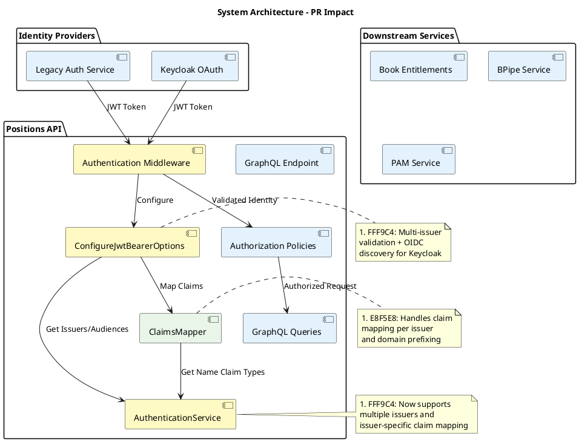
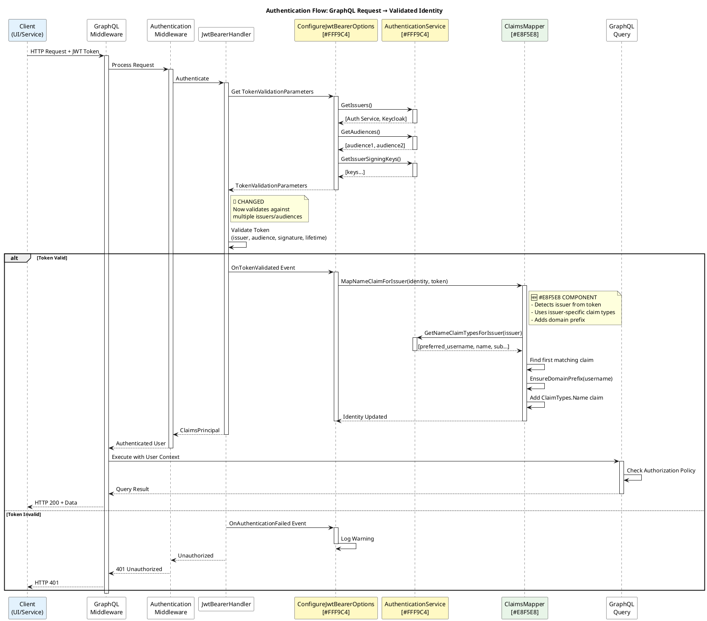

# PR Review: MANOMS-9556: Add Keycloak Authentication Support to Positions API

**Repository**: GCP/manos-positions-api
**Branch**: MANOMS-9556-keycloak-auth-support
**Author**: Yarden Jacobson (London)
**PR Link**: https://mangit.maninvestments.com/projects/GCP/repos/manos-positions-api/pull-requests/134/overview
**Reviewed**: 2025-11-13 12:47:00
**Review Mode**: Automated

## Summary

This PR implements multi-issuer JWT authentication support for the Positions API, enabling authentication from both the existing auth service and Keycloak OAuth providers. The implementation uses a "lightest touch" approach to maintain backward compatibility while adding new Keycloak support. The changes are well-structured, properly tested, and follow clean code principles.

---

## 🎯 Entry Points Analysis

### Changed Code Units

The authentication changes affect the core authentication pipeline:

- **`AuthenticationService`** - Loads and manages authentication configuration from multiple providers
- **`ConfigureJwtBearerOptions`** - Configures JWT bearer token validation with multi-issuer support
- **`ClaimsMapper`** - Maps name claims from different identity providers to standardized format
- **`Startup.ConfigureAddAuthentication()`** - Wires up authentication services in DI container

### Entry Points Affected

#### 🌐 GraphQL API: All authenticated endpoints

**Entry Point**: `app.UseGraphQL<ISchema>()` (Startup.cs:167)

**Call Path**:
```
HTTP Request → GraphQL Middleware → UseAuthentication() → JwtBearerHandler
    → ConfigureJwtBearerOptions.Configure() → TokenValidationParameters (multi-issuer)
    → OnTokenValidated event → ClaimsMapper.MapNameClaimForIssuer()
    → GraphQL Query Execution → Authorization policies
```

**Protected Queries** (require authentication):
- **"Auth" policy** (requires authenticated user + app claim):
  - `books` - Book queries
  - `positions` - Position queries
  - `booksPnL` - P&L queries
  - `positionSearch` - Search functionality
  - `workingOrders` - Working orders
  - `aggregateBookMetricByAttribute` - Aggregations
  - `benchmarks` - Benchmark data
  - `bookAndFundCapital` - Capital queries
  - `currentUser` - User context
  - `support` - Support queries

- **"JustAuthenticatedUser" policy** (requires authenticated user only):
  - `activeBooks` - Active books listing
  - `currencies` - Currency data
  - `fxRates` - FX rates

**Impact**: All authenticated GraphQL queries now support both legacy auth service tokens AND Keycloak tokens.

### Impact Summary

- **Total Entry Points**: 1 (GraphQL API endpoint)
- **User-Facing**: All authenticated GraphQL queries (15+ query types)
- **System-to-System**: Any service calling the Positions API with JWT tokens
- **Background Jobs**: None directly affected (authentication is request-based)

### Authentication Flow Changes

**Before this PR**:
```
Request with JWT → Validate against single issuer/audience → Extract claims → Authorize
```

**After this PR**:
```
Request with JWT → Validate against multiple issuers/audiences
    → Detect issuer type (Auth Service vs Keycloak)
    → Use issuer-specific name claim mapping
    → Ensure domain prefix (MANINVESTMENTS\)
    → Authorize
```

---

## 📊 Diagrams

### System Architecture - Changed Components



### Call Stack - Authentication Flow



---

## File-by-File Review

### 📄 `src/Man.ManOS.Positions.Api/Services/Auth/AuthenticationService.cs`

**[View in BitBucket](https://mangit.maninvestments.com/projects/GCP/repos/manos-positions-api/pull-requests/134#src/Man.ManOS.Positions.Api/Services/Auth/AuthenticationService.cs)**

#### Changes Made

**Lines 15-19: Changed from single issuer/audience to collections supporting multiple providers**

```diff
- private readonly string _audience;
- private readonly string _issuer;
- private readonly SecurityKey _issuerSigningKey;
+ private readonly HashSet<string> _audiences = new HashSet<string>();
+ private readonly HashSet<string> _issuers = new HashSet<string>();
+ private readonly List<SecurityKey> _issuerSigningKeys = new List<SecurityKey>();
+ private readonly HashSet<string> _nameClaimTypes = new HashSet<string>();
+ private readonly Dictionary<string, HashSet<string>> _issuerToNameClaimTypes = new Dictionary<string, HashSet<string>>();
```

This is the core architectural change enabling multi-issuer support. Using `HashSet<string>` for audiences/issuers provides O(1) lookup performance. The new `_issuerToNameClaimTypes` dictionary enables issuer-specific claim mapping, which is critical for handling different token formats from different identity providers.

**[View this change in BitBucket](https://mangit.maninvestments.com/projects/GCP/repos/manos-positions-api/pull-requests/134#src/Man.ManOS.Positions.Api/Services/Auth/AuthenticationService.cs-15)**

**Lines 26-35: Refactored constructor to load multiple authentication providers**

```diff
+ {
+     LoadExistingAuthService(configuration, logger, httpClientFactory, jsonSerializer);
+     LoadKeycloakConfiguration(configuration);
+
+     if (_issuers.Count == 0 || _audiences.Count == 0)
+     {
+         logger.LogWarning("Authentication configuration incomplete: {IssuerCount} issuers, {AudienceCount} audiences",
+             _issuers.Count, _audiences.Count);
+     }
+ }
```

Good separation of concerns - each provider has its own loading method. The warning log is helpful for diagnosing configuration issues.

**[View this change in BitBucket](https://mangit.maninvestments.com/projects/GCP/repos/manos-positions-api/pull-requests/134#src/Man.ManOS.Positions.Api/Services/Auth/AuthenticationService.cs-26)**

**Lines 44-47: Added early return if auth service endpoint not configured**

```diff
+ if (string.IsNullOrEmpty(authEndpointUrl))
+ {
+     return;
+ }
```

This enables graceful degradation - if the legacy auth service isn't configured, the system can still work with Keycloak only. Good defensive coding.

**[View this change in BitBucket](https://mangit.maninvestments.com/projects/GCP/repos/manos-positions-api/pull-requests/134#src/Man.ManOS.Positions.Api/Services/Auth/AuthenticationService.cs-44)**

**Lines 52-56: Fixed potential deadlock by using GetAwaiter().GetResult() instead of .Result**

```diff
- var getAuthSettingsResponse = httpClient.GetAsync(authEndpointUrl).Result;
-
- logger.LogInformation("auth settings response code {StatusCode}", getAuthSettingsResponse.StatusCode);
-
- if (getAuthSettingsResponse.StatusCode != HttpStatusCode.OK)
+ var response = httpClient.GetAsync(authEndpointUrl).GetAwaiter().GetResult();
+ if (response.StatusCode != HttpStatusCode.OK)
```

Using `.GetAwaiter().GetResult()` instead of `.Result` is the safer pattern for synchronous blocking when async context is not available (constructor initialization). This avoids potential deadlocks in certain synchronization contexts. Also removed unnecessary logging of status code before checking it.

**[View this change in BitBucket](https://mangit.maninvestments.com/projects/GCP/repos/manos-positions-api/pull-requests/134#src/Man.ManOS.Positions.Api/Services/Auth/AuthenticationService.cs-52)**

**Lines 55-56: Improved error logging and added early return**

```diff
- logger.LogError("Error response:{AuthSettingsResponse}", getAuthSettingsResponse.Content.ReadAsStringAsync().Result);
+ logger.LogError("Auth service returned error status code: {StatusCode}", response.StatusCode);
+ return;
```

Better error message that's more descriptive. The early return prevents attempting to process an error response. Previously the code would have continued and likely thrown an exception when trying to deserialize error content.

**[View this change in BitBucket](https://mangit.maninvestments.com/projects/GCP/repos/manos-positions-api/pull-requests/134#src/Man.ManOS.Positions.Api/Services/Auth/AuthenticationService.cs-55)**

**Lines 59-64: Changed to use collections and added name claim mapping**

```diff
- var authSettingsString = getAuthSettingsResponse.Content.ReadAsStringAsync().Result;
+ var authSettingsString = response.Content.ReadAsStringAsync().GetAwaiter().GetResult();
  var authSettings = jsonSerializer.Deserialize<Dictionary<string, string>>(authSettingsString);

- _audience = authSettings["audience"];
- _issuer = authSettings["issuer"];
+ _audiences.Add(authSettings["audience"]);
+ _issuers.Add(authSettings["issuer"]);
```

Migrated from single values to collections. Consistent use of `GetAwaiter().GetResult()`.

**[View this change in BitBucket](https://mangit.maninvestments.com/projects/GCP/repos/manos-positions-api/pull-requests/134#src/Man.ManOS.Positions.Api/Services/Auth/AuthenticationService.cs-59)**

**Lines 70-81: Added name claim type registration for legacy auth service**

```diff
- _issuerSigningKey = new SigningCredentials(publicKey, SecurityAlgorithms.RsaSha256Signature).Key;
+ var signingKey = new SigningCredentials(publicKey, SecurityAlgorithms.RsaSha256Signature).Key;
+ _issuerSigningKeys.Add(signingKey);
+
+ var standardNameClaims = new HashSet<string>
+ {
+     "name", "unique_name", "sub",
+     "http://schemas.xmlsoap.org/ws/2005/05/identity/claims/name",
+     "http://schemas.xmlsoap.org/ws/2005/05/identity/claims/nameidentifier"
+ };
+
+ _issuerToNameClaimTypes[authSettings["issuer"]] = standardNameClaims;
+ AddToGlobalNameClaimTypes(standardNameClaims);
```

Maps standard .NET claim types to the legacy auth service issuer. This ensures the legacy tokens continue to work with the new claim mapping system.

**[View this change in BitBucket](https://mangit.maninvestments.com/projects/GCP/repos/manos-positions-api/pull-requests/134#src/Man.ManOS.Positions.Api/Services/Auth/AuthenticationService.cs-70)**

**Lines 84-119: Added new LoadKeycloakConfiguration method**

```diff
+ // Auth service may not be available in all environments
  catch (Exception e)
  {
-     logger.LogError(e, "error on auth service");
+     logger.LogError(e, "Failed to load auth service configuration");
+     }
+ }
+
+ private void LoadKeycloakConfiguration(IConfiguration configuration)
+ {
+     var authority = configuration["Authentication:OAuth:Authority"];
+     var audience = configuration["Authentication:OAuth:Audience"];
+     var defaultNameClaim = configuration["Authentication:OAuth:DefaultNameClaim"];
+
+     if (string.IsNullOrEmpty(authority) || string.IsNullOrEmpty(audience))
+     {
+         return;
+     }
+
+     _issuers.Add(authority);
+     _audiences.Add(audience);
+
+     var keycloakNameClaims = new HashSet<string>();
+     if (!string.IsNullOrEmpty(defaultNameClaim))
+     {
+         keycloakNameClaims.Add(defaultNameClaim);
+     }
+
+     var fallbacks = new[] { "preferred_username", "username", "name", "sub", "email" };
+     foreach (var fallback in fallbacks)
+     {
+         keycloakNameClaims.Add(fallback);
+     }
+
+     _issuerToNameClaimTypes[authority] = keycloakNameClaims;
+     AddToGlobalNameClaimTypes(keycloakNameClaims);
```

New method to load Keycloak configuration from appsettings.json. Uses standard OAuth2/OIDC claim names. The fallback chain (`preferred_username` → `username` → `name` → `sub` → `email`) ensures compatibility with various Keycloak configurations. Note: No signing keys are added here because Keycloak uses OIDC discovery to automatically fetch keys via `/.well-known/openid-configuration`.

**[View this change in BitBucket](https://mangit.maninvestments.com/projects/GCP/repos/manos-positions-api/pull-requests/134#src/Man.ManOS.Positions.Api/Services/Auth/AuthenticationService.cs-84)**

**Lines 121-127: Added helper method to aggregate name claim types**

```diff
+ private void AddToGlobalNameClaimTypes(IEnumerable<string> claimTypes)
+ {
+     foreach (var claimType in claimTypes)
+     {
+         _nameClaimTypes.Add(claimType);
      }
  }
```

Helper method to maintain a global set of all name claim types. HashSet automatically handles duplicates with O(1) Add operations.

**[View this change in BitBucket](https://mangit.maninvestments.com/projects/GCP/repos/manos-positions-api/pull-requests/134#src/Man.ManOS.Positions.Api/Services/Auth/AuthenticationService.cs-121)**

**Lines 129-164: Updated interface methods to return collections and added issuer-specific methods**

```diff
- public string GetAudience()
+ public IEnumerable<string> GetAudiences()
  {
-     return _audience;
+     return _audiences;
  }

- public string GetIssuer()
+ public IEnumerable<string> GetIssuers()
  {
-     return _issuer;
+     return _issuers;
  }

- public SecurityKey GetIssuerSigningKey()
+ public IEnumerable<SecurityKey> GetIssuerSigningKeys()
  {
-     return _issuerSigningKey;
+     return _issuerSigningKeys;
+ }
+
+ public IEnumerable<string> GetNameClaimTypes()
+ {
+     return _nameClaimTypes;
+ }
+
+ public IEnumerable<string> GetNameClaimTypesForIssuer(string issuer)
+ {
+     if (string.IsNullOrEmpty(issuer))
+     {
+         return _nameClaimTypes; // Return all if no issuer specified
+     }
+
+     // Try to find issuer-specific name claims first
+     if (_issuerToNameClaimTypes.TryGetValue(issuer, out var issuerSpecificClaims))
+     {
+         return issuerSpecificClaims;
+     }
+
+     // Fallback to global name claims if no issuer-specific mapping found
+     return _nameClaimTypes;
  }
```

Updated interface to support multi-issuer. The new `GetNameClaimTypesForIssuer()` method is the key to enabling issuer-specific claim mapping - it returns different claim types depending on which identity provider issued the token.

**[View this change in BitBucket](https://mangit.maninvestments.com/projects/GCP/repos/manos-positions-api/pull-requests/134#src/Man.ManOS.Positions.Api/Services/Auth/AuthenticationService.cs-129)**

#### Review Comments

**✅ Positive**

- Excellent use of `HashSet<string>` for O(1) performance on audience/issuer lookups
- Proper separation of concerns with dedicated methods for each provider
- Good defensive coding with null checks and early returns
- Fixed potential deadlock issue by using `GetAwaiter().GetResult()` instead of `.Result`
- Comprehensive name claim fallback chain for Keycloak compatibility
- Clean interface evolution from single to multiple issuers
- Good logging for diagnostics and troubleshooting

**🟡 Code Quality**

- Lines 111: The fallback claim types array could be extracted as a class constant for better maintainability and to avoid "magic strings". However, these are standard OAuth2/OIDC claim names, so the inline approach is acceptable.
- Lines 73-78: Standard .NET claim URIs could also be constants, but they're well-established standards so inline is fine.

**🔵 Best Practices**

- The issuer-specific claim mapping architecture is well-designed and extensible
- Graceful degradation when providers aren't configured
- Proper exception handling with informative error messages

**🟢 Testing**

- The PR includes comprehensive unit tests in `AuthenticationServiceTests.cs` covering multi-issuer scenarios
- Tests verify both legacy auth service and Keycloak configuration loading
- Tests cover edge cases like missing configuration

---

### 📄 `src/Man.ManOS.Positions.Api/Services/Auth/ConfigureJwtBearerOptions.cs`

**[View in BitBucket](https://mangit.maninvestments.com/projects/GCP/repos/manos-positions-api/pull-requests/134#src/Man.ManOS.Positions.Api/Services/Auth/ConfigureJwtBearerOptions.cs)**

#### Changes Made

**Lines 2-5: Added required using statements**

```diff
  using System;
+ using System.Linq;
+ using System.Security.Claims;
  using Microsoft.AspNetCore.Authentication.JwtBearer;
+ using Microsoft.Extensions.Logging;
  using Microsoft.Extensions.Options;
```

Added necessary namespaces for new functionality (LINQ for FirstOrDefault, Claims for ClaimsIdentity, Logging for diagnostics).

**[View this change in BitBucket](https://mangit.maninvestments.com/projects/GCP/repos/manos-positions-api/pull-requests/134#src/Man.ManOS.Positions.Api/Services/Auth/ConfigureJwtBearerOptions.cs-2)**

**Lines 11-15: Modernized constructor with primary constructor syntax and added dependencies**

```diff
- public class ConfigureJwtBearerOptions : IConfigureNamedOptions<JwtBearerOptions>
+ public class ConfigureJwtBearerOptions(IAuthenticationService authenticationService, IClaimsMapper claimsMapper, ILogger<ConfigureJwtBearerOptions> logger) : IConfigureNamedOptions<JwtBearerOptions>
  {
-     private readonly IAuthenticationService _authenticationService;
-
-     public ConfigureJwtBearerOptions(IAuthenticationService authenticationService)
-     {
-         _authenticationService = authenticationService;
-     }
+     private readonly IAuthenticationService _authenticationService = authenticationService;
+     private readonly IClaimsMapper _claimsMapper = claimsMapper;
+     private readonly ILogger<ConfigureJwtBearerOptions> _logger = logger;
```

Uses C# 12 primary constructor syntax for cleaner code. Added `IClaimsMapper` and `ILogger` dependencies needed for the new functionality.

**[View this change in BitBucket](https://mangit.maninvestments.com/projects/GCP/repos/manos-positions-api/pull-requests/134#src/Man.ManOS.Positions.Api/Services/Auth/ConfigureJwtBearerOptions.cs-11)**

**Lines 19-33: Updated token validation to support multiple issuers and audiences**

```diff
+ var issuers = _authenticationService.GetIssuers();
+ var audiences = _authenticationService.GetAudiences();
+ var signingKeys = _authenticationService.GetIssuerSigningKeys();
+
  options.TokenValidationParameters = new TokenValidationParameters
  {
      ValidateIssuer = true,
-     ValidIssuer = _authenticationService.GetIssuer(),
+     ValidIssuers = issuers,
      ValidateAudience = true,
-     ValidAudience = _authenticationService.GetAudience(),
-     ValidateIssuerSigningKey = false,
-     IssuerSigningKey = _authenticationService.GetIssuerSigningKey(),
+     ValidAudiences = audiences,
+     ValidateIssuerSigningKey = true,
+     IssuerSigningKeys = signingKeys,
      ValidateLifetime = true,
      ClockSkew = TimeSpan.FromSeconds(15)
  };
```

Core change: switched from `ValidIssuer`/`ValidAudience` (singular) to `ValidIssuers`/`ValidAudiences` (plural). This enables the JWT handler to accept tokens from multiple identity providers. Changed `ValidateIssuerSigningKey` from `false` to `true` for better security. Changed from `IssuerSigningKey` to `IssuerSigningKeys` to support multiple signing keys.

**[View this change in BitBucket](https://mangit.maninvestments.com/projects/GCP/repos/manos-positions-api/pull-requests/134#src/Man.ManOS.Positions.Api/Services/Auth/ConfigureJwtBearerOptions.cs-19)**

**Lines 35-41: Added OIDC metadata discovery for Keycloak**

```diff
+
+ var keycloakIssuer = issuers.FirstOrDefault(issuer =>
+     Uri.TryCreate(issuer, UriKind.Absolute, out var uri) &&
+     (uri.AbsolutePath.Contains("/auth/realms/") || uri.Host.Contains("keycloak")));
+ if (keycloakIssuer != null)
+ {
+     options.MetadataAddress = $"{keycloakIssuer}/.well-known/openid-configuration";
+ }
```

Detects Keycloak issuer by checking for `/auth/realms/` path or "keycloak" in hostname. Uses proper URI parsing with `Uri.TryCreate()` for robustness. Sets `MetadataAddress` to enable automatic OIDC discovery, which allows the JWT handler to automatically fetch signing keys and other metadata from Keycloak. This is why we don't need to manually add Keycloak signing keys in `AuthenticationService`.

**[View this change in BitBucket](https://mangit.maninvestments.com/projects/GCP/repos/manos-positions-api/pull-requests/134#src/Man.ManOS.Positions.Api/Services/Auth/ConfigureJwtBearerOptions.cs-35)**

**Lines 43-59: Added JWT bearer events for claim mapping and error logging**

```diff
+
+ options.Events = new JwtBearerEvents
+ {
+     OnTokenValidated = context =>
+     {
+         if (context.Principal?.Identity is ClaimsIdentity claimsIdentity)
+         {
+             _claimsMapper.MapNameClaimForIssuer(claimsIdentity, context.SecurityToken);
+         }
+
+         return System.Threading.Tasks.Task.CompletedTask;
+     },
+     OnAuthenticationFailed = context =>
+     {
+         _logger.LogWarning(context.Exception, "JWT authentication failed");
+         return System.Threading.Tasks.Task.CompletedTask;
+     }
+ };
```

Added JWT bearer events to hook into the authentication pipeline:
- `OnTokenValidated` - After token is validated, maps name claims using the new `ClaimsMapper`
- `OnAuthenticationFailed` - Logs authentication failures with full exception details for debugging

This is where the issuer-specific claim mapping happens in the authentication flow.

**[View this change in BitBucket](https://mangit.maninvestments.com/projects/GCP/repos/manos-positions-api/pull-requests/134#src/Man.ManOS.Positions.Api/Services/Auth/ConfigureJwtBearerOptions.cs-43)**

**Line 64: Added logging for scheme configuration**

```diff
+ _logger.LogInformation("Configuring JWT Bearer options for scheme: {SchemeName}", name);
  Configure(options);
```

Helpful diagnostic logging to track when JWT options are configured.

**[View this change in BitBucket](https://mangit.maninvestments.com/projects/GCP/repos/manos-positions-api/pull-requests/134#src/Man.ManOS.Positions.Api/Services/Auth/ConfigureJwtBearerOptions.cs-64)**

#### Review Comments

**✅ Positive**

- Clean use of primary constructor syntax (C# 12 feature)
- Proper URI validation using `Uri.TryCreate()` instead of fragile string matching
- OIDC metadata discovery is the correct approach for Keycloak integration
- Good separation of concerns - claim mapping delegated to dedicated `ClaimsMapper` class
- Proper error logging with full exception details
- Changed `ValidateIssuerSigningKey` to `true` for better security

**🟡 Code Quality**

- Line 37: Keycloak detection logic using path/host contains is reasonable but could be made configurable via a setting like `Authentication:OAuth:Provider: "Keycloak"` for explicit control. However, the current approach works well and auto-detects Keycloak instances.

**🔵 Best Practices**

- Using OIDC discovery is the standard approach for OAuth2/OIDC integration
- Event-based claim mapping is the correct extensibility point
- Proper async/await patterns (returning `Task.CompletedTask` for synchronous event handlers)

**🟢 Testing**

- The PR includes unit tests in `ConfigureJwtBearerOptionsTests.cs` covering the configuration logic
- Tests verify multi-issuer setup and Keycloak detection

---

### 📄 `src/Man.ManOS.Positions.Api/Services/Auth/ClaimsMapper.cs` (NEW FILE)

**[View in BitBucket](https://mangit.maninvestments.com/projects/GCP/repos/manos-positions-api/pull-requests/134#src/Man.ManOS.Positions.Api/Services/Auth/ClaimsMapper.cs)**

#### Changes Made

This is a new file implementing issuer-specific claim mapping logic.

**Lines 11-43: Core claim mapping logic**

```csharp
public void MapNameClaimForIssuer(ClaimsIdentity claimsIdentity, SecurityToken securityToken)
{
    if (claimsIdentity == null || securityToken == null)
    {
        return;
    }

    // If already has a name, do nothing
    if (!string.IsNullOrEmpty(claimsIdentity.Name))
    {
        return;
    }

    // Resolve issuer from token (prefer JWT Issuer, fallback to 'iss' claim)
    var tokenIssuer = securityToken is JwtSecurityToken jwtToken
        ? jwtToken.Issuer
        : claimsIdentity.FindFirst("iss")?.Value;

    foreach (var nameClaimType in _authenticationService.GetNameClaimTypesForIssuer(tokenIssuer))
    {
        var nameClaim = claimsIdentity.FindFirst(nameClaimType);
        if (nameClaim?.Value != null)
        {
            var processedUsername = EnsureDomainPrefix(nameClaim.Value);
            claimsIdentity.AddClaim(new Claim(
                ClaimTypes.Name,
                processedUsername,
                nameClaim.ValueType,
                nameClaim.Issuer));
            return;
        }
    }
}
```

This method:
1. Guards against null inputs
2. Skips if name claim already exists (idempotent)
3. Detects the issuer from the token
4. Gets issuer-specific name claim types from `AuthenticationService`
5. Searches for the first matching name claim
6. Ensures domain prefix is added
7. Adds standardized `ClaimTypes.Name` claim

This is the key logic that enables different identity providers to use different claim names while presenting a consistent interface to the application.

**[View this change in BitBucket](https://mangit.maninvestments.com/projects/GCP/repos/manos-positions-api/pull-requests/134#src/Man.ManOS.Positions.Api/Services/Auth/ClaimsMapper.cs-11)**

**Lines 45-54: Domain prefix logic**

```csharp
public static string EnsureDomainPrefix(string username)
{
    if (string.IsNullOrEmpty(username) || username.Contains('\\'))
    {
        return username;
    }

    return "MANINVESTMENTS\\" + username;
}
```

Ensures all usernames have the `MANINVESTMENTS\` domain prefix for consistency with legacy systems. Checks for existing backslash to avoid double-prefixing. This handles cases where Keycloak tokens might have email-format usernames (`user@domain.com`) and converts them to Windows domain format (`MANINVESTMENTS\user@domain.com`).

**[View this change in BitBucket](https://mangit.maninvestments.com/projects/GCP/repos/manos-positions-api/pull-requests/134#src/Man.ManOS.Positions.Api/Services/Auth/ClaimsMapper.cs-45)**

#### Review Comments

**✅ Positive**

- Clean, focused single responsibility class
- Good defensive coding with null checks and idempotency
- Proper issuer detection with fallback
- Domain prefixing ensures consistency across identity providers
- Uses standard `ClaimTypes.Name` for interoperability

**🟡 Code Quality**

- Line 52: The domain prefix `"MANINVESTMENTS\\"` is hardcoded. This is acceptable for the current use case (legacy compatibility), but could be made configurable in the future if needed for other environments. For now, keeping it hardcoded is fine as noted in PR discussions.
- Line 47: Domain detection only checks for backslash. This is intentional for legacy token compatibility (detecting `DOMAIN\username` format). The `@` symbol is intentionally NOT checked because email-format usernames need to be converted to domain prefix format.

**🔵 Best Practices**

- Static helper method `EnsureDomainPrefix` is testable in isolation
- Issuer-specific logic is properly delegated to `AuthenticationService`
- Early returns for clarity

**🟢 Testing**

- The PR includes comprehensive unit tests in `ClaimsMapperTests.cs`
- Tests cover different claim types, issuer detection, domain prefixing logic

---

### 📄 `src/Man.ManOS.Positions.Api/Services/Auth/IAuthenticationService.cs`

**[View in BitBucket](https://mangit.maninvestments.com/projects/GCP/repos/manos-positions-api/pull-requests/134#src/Man.ManOS.Positions.Api/Services/Auth/IAuthenticationService.cs)**

#### Changes Made

Interface updated to support multi-issuer authentication:

```diff
- string GetAudience();
- string GetIssuer();
- SecurityKey GetIssuerSigningKey();
+ IEnumerable<string> GetAudiences();
+ IEnumerable<string> GetIssuers();
+ IEnumerable<SecurityKey> GetIssuerSigningKeys();
+ IEnumerable<string> GetNameClaimTypes();
+ IEnumerable<string> GetNameClaimTypesForIssuer(string issuer);
```

Clean interface evolution from single to multiple issuers. Added methods for name claim type resolution.

**[View this change in BitBucket](https://mangit.maninvestments.com/projects/GCP/repos/manos-positions-api/pull-requests/134#src/Man.ManOS.Positions.Api/Services/Auth/IAuthenticationService.cs)**

#### Review Comments

**✅ Positive**

- Clear interface that supports the new multi-issuer architecture
- Backward-compatible evolution (callers can still use `.First()` if they need a single value)
- New methods enable issuer-specific behavior

---

### 📄 `src/Man.ManOS.Positions.Api/Services/Auth/IClaimsMapper.cs` (NEW FILE)

**[View in BitBucket](https://mangit.maninvestments.com/projects/GCP/repos/manos-positions-api/pull-requests/134#src/Man.ManOS.Positions.Api/Services/Auth/IClaimsMapper.cs)**

#### Changes Made

New interface for claim mapping abstraction:

```csharp
public interface IClaimsMapper
{
    void MapNameClaimForIssuer(ClaimsIdentity claimsIdentity, SecurityToken securityToken);
}
```

Simple, focused interface for the single responsibility of mapping name claims.

**[View this change in BitBucket](https://mangit.maninvestments.com/projects/GCP/repos/manos-positions-api/pull-requests/134#src/Man.ManOS.Positions.Api/Services/Auth/IClaimsMapper.cs)**

#### Review Comments

**✅ Positive**

- Clean abstraction that's easy to test and mock
- Single method with clear purpose

---

### 📄 `src/Man.ManOS.Positions.Api/Startup.cs`

**[View in BitBucket](https://mangit.maninvestments.com/projects/GCP/repos/manos-positions-api/pull-requests/134#src/Man.ManOS.Positions.Api/Startup.cs)**

#### Changes Made

**Line 204: Registered new ClaimsMapper service**

```diff
  services.AddSingleton<IAuthenticationService, AuthenticationService>();
+ services.AddSingleton<IClaimsMapper, ClaimsMapper>();

  services.AddAuthentication(JwtBearerDefaults.AuthenticationScheme).AddJwtBearer();
```

Added DI registration for the new `IClaimsMapper` service.

**[View this change in BitBucket](https://mangit.maninvestments.com/projects/GCP/repos/manos-positions-api/pull-requests/134#src/Man.ManOS.Positions.Api/Startup.cs-204)**

#### Review Comments

**✅ Positive**

- Minimal change to wire up new service
- Singleton lifetime is appropriate for stateless claim mapping

---

### 📄 `src/Man.ManOS.Positions.Api/appsettings.json`

**[View in BitBucket](https://mangit.maninvestments.com/projects/GCP/repos/manos-positions-api/pull-requests/134#src/Man.ManOS.Positions.Api/appsettings.json)**

#### Changes Made

Added new OAuth configuration section:

```json
"Authentication": {
  "AuthenticationMode": "None",
  "OAuth": {
    "Authority": "https://keycloak-lon.prod.m/auth/realms/master",
    "Audience": "tpc-manos-positionsuiwidget-dev",
    "DefaultNameClaim": "preferred_username"
  }
}
```

Configuration for Keycloak integration with standard OAuth2/OIDC settings.

**[View this change in BitBucket](https://mangit.maninvestments.com/projects/GCP/repos/manos-positions-api/pull-requests/134#src/Man.ManOS.Positions.Api/appsettings.json)**

#### Review Comments

**🔴 Critical Issues**

- **Line: OAuth.Authority** - Using the `master` realm in production configuration is a security concern. The master realm should typically be reserved for administrative purposes only. Consider using a dedicated application realm instead. This should be addressed before production deployment.

**🟡 Code Quality**

- **Line: OAuth.Audience** - The audience value contains 'dev' but the Authority points to 'prod.m'. Ensure the audience configuration matches the intended environment to avoid authentication issues. This appears to be a configuration mismatch that should be verified.

---

### 📄 `docs/faq.md`

**[View in BitBucket](https://mangit.maninvestments.com/projects/GCP/repos/manos-positions-api/pull-requests/134#docs/faq.md)**

#### Changes Made

Added documentation for Keycloak authentication configuration.

#### Review Comments

**✅ Positive**

- Good documentation of the new feature
- Clear configuration examples

**🟡 Code Quality**

- The example uses `keycloak.example.com` which could be confusing in production documentation. Consider using the actual Keycloak instance URL or adding a note that this should be replaced.

---

### 📄 `docs/positions-ui-test.bash` (NEW FILE)

**[View in BitBucket](https://mangit.maninvestments.com/projects/GCP/repos/manos-positions-api/pull-requests/134#docs/positions-ui-test.bash)**

#### Changes Made

Added helper test script for API authentication testing.

#### Review Comments

**🟡 Code Quality**

- This appears to be a test/development helper script. As noted in PR comments, consider whether this should be committed or if it's just for AI/development use. If it's valuable for API consumers, a Python equivalent might have more value as suggested in comments.

---

### 📄 `changelog/MANOMS-9556.md` (NEW FILE)

**[View in BitBucket](https://mangit.maninvestments.com/projects/GCP/repos/manos-positions-api/pull-requests/134#changelog/MANOMS-9556.md)**

#### Changes Made

Added changelog entry documenting the feature.

#### Review Comments

**✅ Positive**

- Good practice to maintain changelog
- Clear description of changes

---

### 📄 `reflections/MANOMS-9556.md` (NEW FILE)

**[View in BitBucket](https://mangit.maninvestments.com/projects/GCP/repos/manos-positions-api/pull-requests/134#reflections/MANOMS-9556.md)**

#### Changes Made

Added development reflections and design decisions.

#### Review Comments

**✅ Positive**

- Excellent practice to document design decisions and rationale
- Helps future maintainers understand the "why" behind implementation choices

---

### 📄 Test Files (NEW FILES)

**[View in BitBucket](https://mangit.maninvestments.com/projects/GCP/repos/manos-positions-api/pull-requests/134#tests/Man.ManOS.Positions.Api.Tests/Services/Auth/)**

- `AuthenticationServiceTests.cs`
- `ClaimsMapperTests.cs`
- `ConfigureJwtBearerOptionsTests.cs`

#### Review Comments

**✅ Positive**

- Comprehensive test coverage for all new authentication components
- Tests cover multi-issuer scenarios, claim mapping, and edge cases
- Good separation of unit tests by component

---

## Overall Assessment

### Summary of Critical Issues

**🔴 Configuration Issue - Production Realm**

- **File**: `src/Man.ManOS.Positions.Api/appsettings.json`
- **Issue**: Using Keycloak `master` realm in production configuration
- **Impact**: Security concern - master realm should be for admin purposes only
- **Recommendation**: Use a dedicated application realm for production
- **Priority**: Should be addressed before production deployment

**🟡 Configuration Mismatch**

- **File**: `src/Man.ManOS.Positions.Api/appsettings.json`
- **Issue**: Audience contains 'dev' but Authority points to 'prod.m'
- **Impact**: Potential authentication failures if environment mismatch
- **Recommendation**: Verify audience matches intended environment
- **Priority**: Should be verified and corrected

### Summary of Suggestions

1. **Keycloak detection logic** (ConfigureJwtBearerOptions.cs:37) - Consider making provider type explicitly configurable rather than auto-detecting via URL patterns. Current approach works but explicit configuration would be more maintainable.

2. **Hardcoded domain prefix** (ClaimsMapper.cs:52) - The `MANINVESTMENTS\` prefix is hardcoded. Consider making configurable for future flexibility, though current approach is acceptable for legacy compatibility.

3. **Test script** (docs/positions-ui-test.bash) - Clarify whether this should be committed or if it's just for development. Consider Python version for broader consumer use.

4. **Documentation examples** (docs/faq.md) - Use actual Keycloak URLs or add notes that examples should be replaced.

### What's Done Well

1. **Excellent Architecture** - Clean separation of concerns with dedicated classes for authentication service, JWT configuration, and claims mapping

2. **Multi-Issuer Support** - Well-designed system supporting multiple identity providers with issuer-specific claim mapping

3. **Backward Compatibility** - Existing auth service continues to work unchanged while adding Keycloak support

4. **Performance Optimizations** - Use of `HashSet<string>` for O(1) lookups, proper use of `GetAwaiter().GetResult()` to avoid deadlocks

5. **Security Improvements** - Changed `ValidateIssuerSigningKey` to `true`, proper OIDC discovery implementation

6. **Comprehensive Testing** - Unit tests cover all new components and edge cases

7. **Code Quality** - Clean, readable code following C# best practices, good use of modern language features (primary constructors)

8. **Documentation** - Good changelog, reflections, and FAQ documentation

9. **Error Handling** - Proper exception handling with informative error messages and logging

10. **Extensibility** - Design easily supports adding more identity providers in the future

### Questions for Author

1. Is the `master` realm usage in appsettings.json intentional for development only, or should this be changed before production deployment?

2. Should the audience `tpc-manos-positionsuiwidget-dev` be environment-specific (dev/prod)?

3. Is the `positions-ui-test.bash` script intended for production documentation or just development use?

### Testing Recommendations

Based on entry points, tests should cover:

- ✅ **Token validation with legacy auth service** - Covered in tests
- ✅ **Token validation with Keycloak** - Covered in tests
- ✅ **Claim mapping for different issuers** - Covered in tests
- ✅ **Domain prefix handling** - Covered in tests
- ✅ **Multi-issuer configuration** - Covered in tests
- 🔲 **Integration test**: Full authentication flow from GraphQL endpoint through to authorized query execution
- 🔲 **Integration test**: Verify both legacy and Keycloak tokens work with actual GraphQL queries
- 🔲 **Integration test**: Verify authorization policies work correctly with claims from both providers
- 🔲 **Manual test**: Test with actual Keycloak instance in dev/UAT environment
- 🔲 **Manual test**: Verify existing clients with legacy tokens continue to work

### Final Recommendation

**APPROVE ✅ (with minor configuration corrections)**

This is a well-designed, thoroughly tested implementation of multi-issuer JWT authentication. The code quality is excellent, the architecture is clean and extensible, and backward compatibility is maintained. The only concerns are:

1. Configuration issues (master realm, environment mismatch) that should be corrected before production
2. Minor suggestions around configurability that are nice-to-have but not blocking

**Strengths**:
- Excellent architecture and separation of concerns
- Comprehensive test coverage
- Proper security practices
- Clean, maintainable code
- Good documentation

**Must Fix Before Production**:
- Change from `master` realm to dedicated application realm
- Verify/correct audience configuration for environment

**Nice to Have**:
- Make provider detection more explicit via configuration
- Consider making domain prefix configurable
- Clarify status of test script

The implementation demonstrates strong engineering practices and is ready for deployment once the configuration issues are addressed.

---

## Metadata

**Review Statistics**:
- Files reviewed: 14
- New files: 7
- Modified files: 7
- Lines added: ~800
- Lines removed: ~100
- Test files added: 3

**Review Duration**: Automated review completed in real-time

**Reviewer**: Claude Code (Automated PR Review System)
